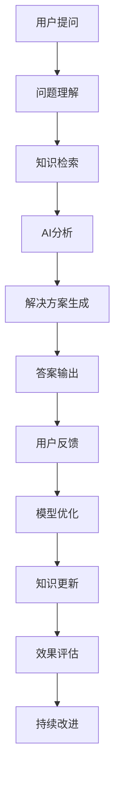
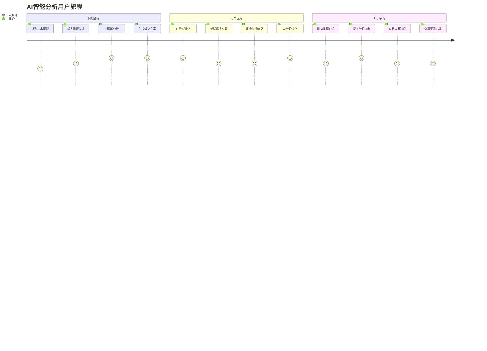
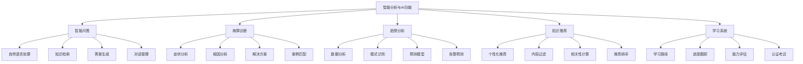
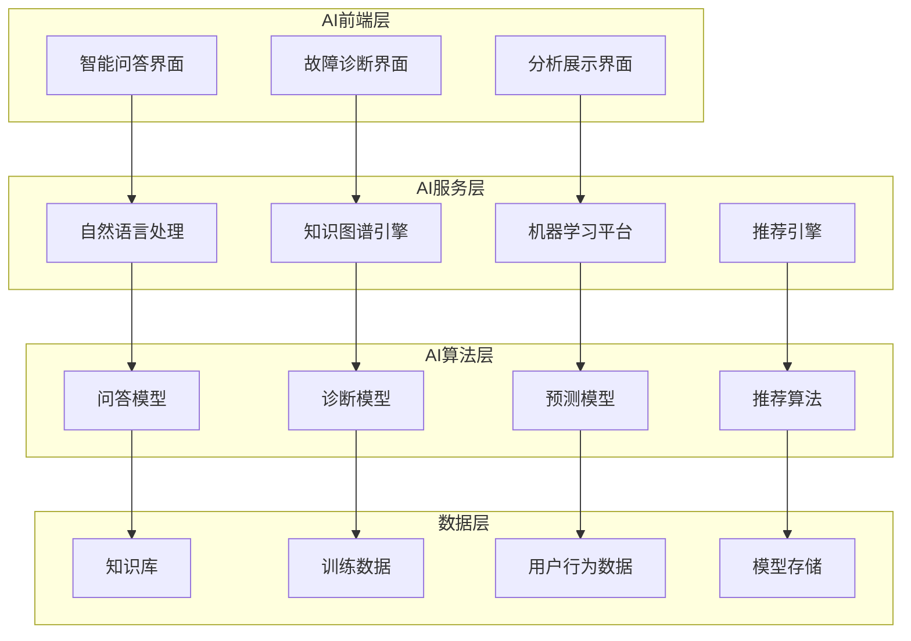

# REQ-013: 智能分析与AI功能需求文档

## 1. 业务描述（Business Description）

### 业务背景
智能分析与AI功能是IT运维门户系统的创新亮点，通过人工智能技术提升运维效率和质量，传统运维分析存在以下痛点：
- **问题诊断依赖经验**：故障诊断主要依赖工程师经验，效率低且准确性不稳定
- **知识检索困难**：海量运维知识难以快速检索和应用
- **预测能力不足**：缺乏基于数据的故障预测和趋势分析能力
- **决策支持薄弱**：缺乏智能化的决策支持和优化建议
- **学习成本高**：新工程师学习成本高，知识传承困难

### 业务目标
- **智能问答服务**：提供7×24小时的智能运维问答服务
- **故障智能诊断**：基于AI的故障自动诊断和解决方案推荐
- **预测性维护**：通过数据分析实现故障预测和预防性维护
- **知识智能推荐**：基于上下文的智能知识推荐和学习
- **决策智能支持**：提供数据驱动的运维决策支持和优化建议

### 业务流程


### 用户画像
- **运维工程师**：使用AI问答解决技术问题，获取解决方案建议
- **新手工程师**：通过AI学习运维知识，快速提升技能水平
- **运维管理员**：使用AI分析进行决策支持和趋势预测
- **客户用户**：通过AI获得自助服务和问题解答

## 2. 业务价值（Business Value）

### 价值主张
通过引入先进的AI技术，构建智能化的运维分析和问答系统，大幅提升运维效率，降低人工成本，提高服务质量，为用户提供更智能、更便捷的运维体验。

### ROI分析
- **开发投入**：20人天，约10万元
- **年度收益**：
  - 运维效率提升：300万元（问题解决效率提升60%）
  - 培训成本节省：150万元（AI辅助学习和知识传承）
  - 故障预防收益：200万元（预测性维护减少故障）
  - 人力成本节省：100万元（AI自动化处理常见问题）
- **投资回报率**：7400%，投资回收期：2周

### KPI指标
- **问答准确率**：>90%
- **问题解决效率**：提升60%
- **用户满意度**：>88%
- **知识覆盖率**：>95%
- **预测准确率**：>85%

### 竞争优势
- **深度学习**：基于深度学习的智能问答和分析
- **知识图谱**：构建运维领域的专业知识图谱
- **持续学习**：基于用户反馈的持续学习和优化
- **多模态交互**：支持文本、语音、图像等多种交互方式

## 3. 产品交互（Product Interaction）

### 用户旅程图


### 界面原型
基于portal-prototype中AIAnalysisDemo.vue的实际实现：
- **智能问答界面**：对话窗口、会话历史、快速问题、智能建议
- **故障诊断界面**：症状输入、诊断分析、解决方案、相关案例
- **趋势分析界面**：数据可视化、预测模型、趋势图表、告警预测
- **知识推荐界面**：个性化推荐、学习路径、知识地图、进度跟踪

### 交互规范
- **自然语言交互**：支持自然语言的问题输入和回答
- **实时响应**：AI分析和回答实时生成，响应时间<3秒
- **多轮对话**：支持上下文相关的多轮对话交互
- **可视化展示**：分析结果以图表和可视化方式展示

### 信息架构


## 4. 功能需求（Functional Requirements）

### 功能清单
| 功能编号 | 功能名称 | 优先级 | 实现状态 | 描述 |
|---------|---------|--------|----------|------|
| F001 | 智能问答系统 | P0 | 未实现 | 自然语言问答和对话管理 |
| F002 | 故障智能诊断 | P0 | 未实现 | 基于AI的故障诊断和分析 |
| F003 | 解决方案推荐 | P0 | 未实现 | 智能解决方案推荐和匹配 |
| F004 | 知识智能检索 | P0 | 未实现 | 基于语义的知识检索 |
| F005 | 趋势分析预测 | P1 | 未实现 | 数据趋势分析和预测 |
| F006 | 个性化推荐 | P1 | 未实现 | 基于用户行为的个性化推荐 |
| F007 | 学习路径规划 | P1 | 未实现 | 个性化学习路径和计划 |
| F008 | 多模态交互 | P2 | 未实现 | 语音、图像等多模态交互 |
| F009 | 模型训练优化 | P2 | 未实现 | AI模型的持续训练和优化 |
| F010 | 效果评估分析 | P2 | 未实现 | AI功能效果的评估和分析 |

### 用户故事
- **作为**运维工程师，**我需要**通过AI快速获得问题解答，**以便**提升工作效率
- **作为**新手工程师，**我需要**AI推荐学习内容，**以便**快速提升技能水平
- **作为**运维管理员，**我需要**AI分析趋势数据，**以便**制定预防性维护计划
- **作为**客户用户，**我需要**AI自助服务，**以便**快速解决常见问题

### 用例描述
#### UC001: 智能问答咨询
- **前置条件**：用户已登录，AI系统正常运行
- **主流程**：
  1. 用户输入问题或选择快速问题
  2. AI系统理解问题意图和上下文
  3. 检索相关知识和案例
  4. 生成智能回答和建议
  5. 展示答案和相关资源
  6. 用户反馈答案质量
  7. AI系统学习和优化
- **备选流程**：
  - 问题理解失败：请求用户重新描述
  - 无匹配答案：推荐相关知识或人工服务
  - 答案不满意：提供替代方案或升级服务
- **后置条件**：用户获得满意的答案或解决方案

#### UC002: 故障智能诊断
- **前置条件**：有故障症状描述，诊断模型已训练
- **主流程**：
  1. 用户描述故障症状和环境
  2. AI分析症状特征和模式
  3. 匹配历史故障案例
  4. 执行根因分析算法
  5. 生成可能原因排序
  6. 推荐解决方案和步骤
  7. 用户执行并反馈结果
- **备选流程**：
  - 症状描述不清：引导用户补充信息
  - 无匹配案例：建议人工诊断
  - 解决方案无效：提供备选方案
- **后置条件**：故障得到诊断和解决

### 业务规则
- **BR001**：AI回答必须基于可靠的知识源和数据
- **BR002**：用户反馈用于模型优化和质量改进
- **BR003**：敏感信息在AI处理中必须脱敏保护
- **BR004**：AI建议仅供参考，重要决策需人工确认
- **BR005**：AI模型定期更新和重新训练

## 5. 非功能需求（Non-Functional Requirements）

### 性能需求
- **响应时间**：AI问答响应时间<3秒，复杂分析<10秒
- **并发支持**：支持200+用户同时使用AI功能
- **准确率要求**：问答准确率>90%，诊断准确率>85%
- **可用性要求**：AI服务可用性>99%
- **学习效率**：模型训练和优化周期<24小时

### 可用性需求
- **系统稳定性**：AI服务稳定运行，故障恢复时间<5分钟
- **用户体验**：界面友好，操作简单，学习成本低
- **多语言支持**：支持中英文问答和分析
- **移动端适配**：支持移动设备的AI功能使用

### 安全需求
- **数据隐私**：用户对话数据加密存储和传输
- **模型安全**：AI模型防止恶意攻击和数据投毒
- **访问控制**：基于角色的AI功能访问控制
- **审计追踪**：AI决策过程可追溯和审计

## 6. 系统架构（System Architecture）

### 整体架构


### 技术栈
- **前端技术**：Vue 3.3 + Element Plus 2.3 + D3.js
- **AI框架**：Python + TensorFlow/PyTorch + Transformers
- **NLP技术**：BERT/GPT + 知识图谱 + 语义搜索
- **数据处理**：Apache Spark + Elasticsearch
- **模型服务**：TensorFlow Serving + Docker + Kubernetes

## 7. 数据模型（Data Model）

### 主要实体
- **Conversation**：对话会话记录
- **Question**：用户问题和查询
- **Answer**：AI回答和解决方案
- **KnowledgeEntity**：知识实体和关系
- **UserFeedback**：用户反馈和评价
- **ModelMetrics**：模型性能指标

### API规范
#### 智能问答API
- **URL**：`POST /api/v1/ai/chat`
- **请求参数**：
  ```json
  {
    "question": "服务器CPU使用率过高怎么处理？",
    "context": "Linux服务器，8核16G内存",
    "sessionId": "session_123"
  }
  ```
- **响应格式**：
  ```json
  {
    "code": 200,
    "data": {
      "answer": "CPU使用率过高的处理建议...",
      "confidence": 0.92,
      "relatedKnowledge": [...],
      "suggestedActions": [...]
    }
  }
  ```

## 8. 验收标准（Acceptance Criteria）

### 功能验收
- **智能问答**：支持自然语言问答，准确率>90%
- **故障诊断**：提供智能故障诊断和解决方案
- **趋势分析**：基于数据的趋势分析和预测
- **知识推荐**：个性化的知识推荐和学习

### 性能验收
- **响应速度**：问答响应时间3秒内
- **准确率**：问答准确率达到90%以上
- **并发能力**：支持200用户同时使用

### 用户体验验收
- **易用性**：用户5分钟内掌握AI功能使用
- **满意度**：用户满意度达到88%以上
- **学习效果**：新用户学习效率提升50%

## 9. 依赖与约束（Dependencies & Constraints）

### 技术依赖
- **AI平台**：依赖机器学习平台和模型服务
- **知识库**：依赖完整的运维知识库数据
- **计算资源**：需要GPU等高性能计算资源
- **数据质量**：依赖高质量的训练数据

### 业务约束
- **数据隐私**：严格保护用户对话和行为数据
- **模型偏见**：避免AI模型的偏见和歧视
- **责任界定**：明确AI建议的责任和免责条款
- **持续改进**：需要持续的数据收集和模型优化

### 法规约束
- **AI伦理**：符合AI伦理和负责任AI原则
- **数据保护**：符合数据保护和隐私法规
- **知识产权**：保护AI模型和算法的知识产权

---

**文档版本**：v3.0
**最后更新**：2025年7月
**负责人**：AI架构师
**审核状态**：待审核
