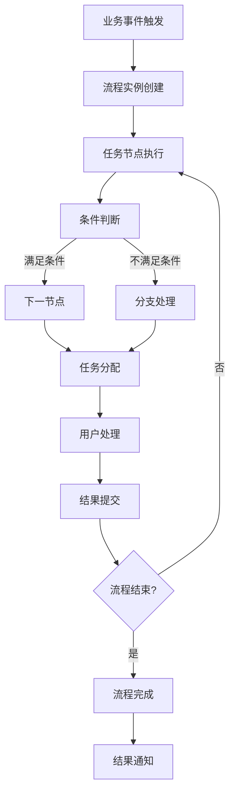
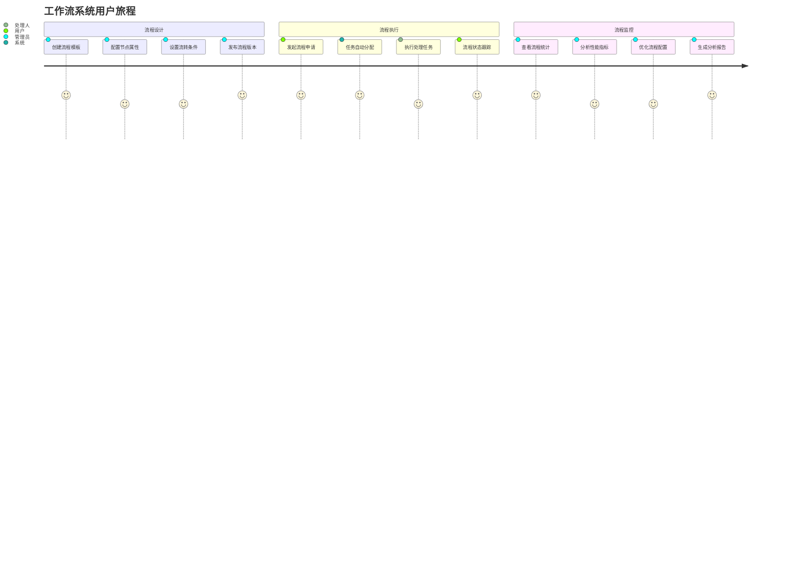
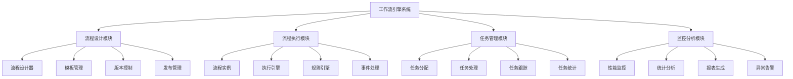
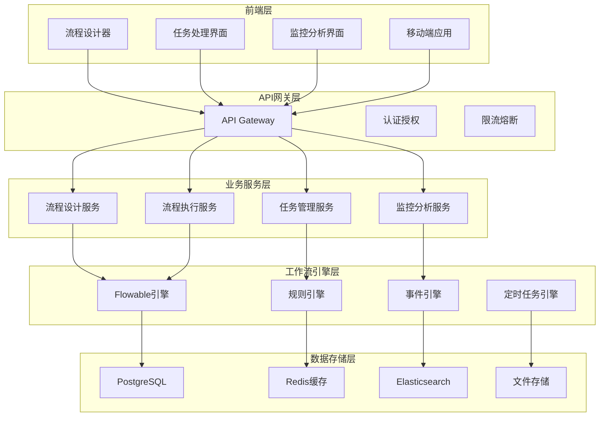
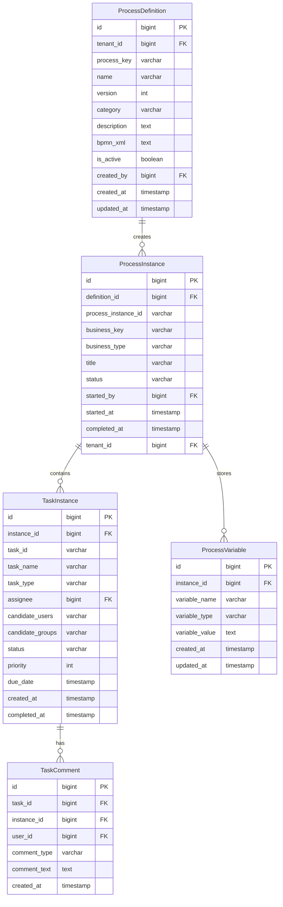

# REQ-014: 工作流引擎系统需求文档

## 1. 业务描述（Business Description）

### 业务背景
工作流引擎系统是IT运维门户系统的核心基础设施，为各业务模块提供统一的流程管理能力。传统的业务流程管理存在以下痛点：
- **流程分散**：各业务模块独立实现流程逻辑，缺乏统一管理
- **流程固化**：业务流程硬编码在系统中，难以灵活调整
- **审批效率低**：缺乏可视化的流程设计和监控工具
- **流程不透明**：流程执行状态不清晰，难以跟踪和优化
- **扩展性差**：新增业务流程需要大量开发工作

### 业务目标
- **统一流程引擎**：为所有业务模块提供统一的工作流服务
- **可视化设计**：支持拖拽式流程设计，业务人员可自主配置
- **智能路由**：基于规则的智能任务分配和流程路由
- **实时监控**：流程执行状态实时监控和性能分析
- **高扩展性**：支持快速扩展新的业务流程类型

### 支撑业务场景
#### 工单流程管理
- **工单创建流程**：工单提交 → 自动分类 → 工程师分配 → 处理执行 → 验收关闭
- **工单升级流程**：超时检测 → 自动升级 → 高级工程师处理 → 管理层介入
- **工单变更流程**：变更申请 → 影响评估 → 审批决策 → 执行实施 → 结果验证

#### 知识库审核流程
- **知识创建流程**：内容提交 → 格式检查 → 专家审核 → 管理员审批 → 发布上线
- **知识更新流程**：修改申请 → 变更审核 → 版本控制 → 发布更新
- **知识下线流程**：下线申请 → 影响评估 → 审批决策 → 执行下线

#### 未来ERP功能
- **合同审批流程**：合同起草 → 法务审核 → 财务审核 → 管理层审批 → 签署执行
- **采购审批流程**：采购申请 → 预算审核 → 供应商选择 → 审批决策 → 采购执行
- **财务审批流程**：费用申请 → 部门审核 → 财务审核 → 管理层审批 → 支付执行

### 业务流程


### 用户画像
- **业务管理员**：设计和配置业务流程，监控流程执行效果
- **流程参与者**：执行流程中的具体任务，推进流程流转
- **审批人员**：在流程节点进行审批决策，控制流程走向
- **系统管理员**：管理流程引擎配置，监控系统运行状态

## 2. 业务价值（Business Value）

### 价值主张
通过构建统一的工作流引擎系统，实现业务流程的标准化、自动化和智能化，提升组织运营效率，降低管理成本，增强业务敏捷性，为企业数字化转型提供强有力的流程支撑。

### ROI分析
- **开发投入**：40人天，约20万元
- **年度收益**：
  - 流程效率提升：300万元（审批时间缩短60%）
  - 管理成本降低：200万元（减少人工协调和跟踪）
  - 合规风险降低：150万元（标准化流程减少违规风险）
  - 业务敏捷性提升：100万元（快速响应业务变化）
- **投资回报率**：3650%，投资回收期：1个月

### KPI指标
- **流程处理效率**：提升60%以上
- **流程透明度**：100%流程状态可视化
- **流程合规率**：>99%
- **系统可用性**：>99.9%
- **流程配置时间**：新流程配置时间<1天

### 竞争优势
- **技术先进性**：基于Flowable引擎，支持BPMN 2.0标准
- **业务适配性**：深度结合IT运维业务场景
- **扩展灵活性**：支持快速扩展新的业务流程
- **集成能力强**：与现有系统无缝集成

## 3. 产品交互（Product Interaction）

### 用户旅程图


### 界面原型
#### 流程设计器界面
- **工具栏**：节点工具、连线工具、配置工具、保存发布
- **设计画布**：拖拽式流程设计，支持缩放和网格对齐
- **属性面板**：节点属性配置、条件设置、人员分配
- **流程预览**：流程图预览、验证检查、模拟执行

#### 任务处理界面
- **任务列表**：待处理任务、已处理任务、任务筛选
- **任务详情**：任务信息、表单数据、处理历史
- **处理操作**：同意、拒绝、转派、加签、退回
- **流程跟踪**：流程进度、处理记录、时间轴展示

#### 流程监控界面
- **统计仪表板**：流程统计、性能指标、趋势分析
- **实例监控**：运行实例、异常实例、性能监控
- **历史分析**：历史数据、效率分析、瓶颈识别
- **报表导出**：统计报表、分析报告、数据导出

### 交互规范
- **流程设计交互**：
  - 支持拖拽创建节点和连线
  - 双击节点进入属性配置
  - 右键菜单提供快捷操作
  - 实时验证流程合法性
- **任务处理交互**：
  - 一键式任务处理操作
  - 表单数据自动保存
  - 处理结果即时反馈
  - 支持批量任务操作
- **监控分析交互**：
  - 交互式图表展示
  - 钻取式数据分析
  - 实时数据刷新
  - 自定义报表配置

### 信息架构


## 4. 功能需求（Functional Requirements）

### 功能清单
| 功能编号 | 功能名称 | 优先级 | 实现状态 | 描述 |
|---------|---------|--------|----------|------|
| F001 | 流程设计器 | P0 | 未实现 | 可视化流程设计，支持BPMN 2.0标准 |
| F002 | 流程模板管理 | P0 | 未实现 | 流程模板的创建、编辑、版本管理 |
| F003 | 流程实例管理 | P0 | 未实现 | 流程实例的创建、执行、监控 |
| F004 | 任务分配引擎 | P0 | 未实现 | 智能任务分配和负载均衡 |
| F005 | 任务处理界面 | P0 | 未实现 | 任务列表、详情、处理操作 |
| F006 | 流程监控 | P1 | 未实现 | 实时监控流程执行状态和性能 |
| F007 | 审批操作 | P0 | 未实现 | 同意、拒绝、转派、加签等操作 |
| F008 | 流程跟踪 | P1 | 未实现 | 流程进度跟踪和历史记录 |
| F009 | 条件路由 | P1 | 未实现 | 基于条件的智能流程路由 |
| F010 | 超时处理 | P1 | 🔄部分实现 | 任务超时自动处理和升级 |
| F011 | 流程统计 | P1 | 未实现 | 流程执行统计和分析报告 |
| F012 | 表单集成 | P1 | 未实现 | 动态表单生成和数据绑定 |
| F013 | 权限控制 | P0 | 未实现 | 基于角色的流程权限控制 |
| F014 | 事件通知 | P1 | 未实现 | 流程事件的自动通知推送 |
| F015 | API集成 | P1 | 未实现 | 提供REST API供其他系统集成 |

### 用户故事
- **作为**业务管理员，**我需要**设计和配置业务流程，**以便**标准化业务操作流程
- **作为**流程参与者，**我需要**查看和处理分配给我的任务，**以便**推进流程执行
- **作为**申请人，**我需要**发起流程申请并跟踪进度，**以便**了解申请处理状态
- **作为**审批人，**我需要**审批流程中的关键节点，**以便**控制流程质量和风险
- **作为**系统管理员，**我需要**监控流程执行性能，**以便**优化系统配置

### 用例描述
#### UC001: 设计业务流程
- **前置条件**：用户具有流程设计权限
- **主流程**：
  1. 用户访问流程设计器
  2. 创建新的流程模板
  3. 拖拽添加流程节点
  4. 配置节点属性和条件
  5. 设置流程路由规则
  6. 验证流程合法性
  7. 保存并发布流程
- **备选流程**：
  - 流程验证失败：显示错误信息，要求修正
  - 权限不足：显示权限不足提示
- **后置条件**：流程模板创建成功，可用于业务流程

#### UC002: 处理工作流任务
- **前置条件**：用户有待处理的工作流任务
- **主流程**：
  1. 用户查看任务列表
  2. 选择待处理任务
  3. 查看任务详情和表单数据
  4. 填写处理意见
  5. 选择处理操作（同意/拒绝/转派）
  6. 提交处理结果
  7. 系统更新流程状态
  8. 通知相关人员
- **备选流程**：
  - 任务已被处理：显示任务状态变更提示
  - 表单验证失败：显示验证错误信息
- **后置条件**：任务处理完成，流程继续流转

#### UC003: 监控流程执行
- **前置条件**：用户具有流程监控权限
- **主流程**：
  1. 用户访问流程监控界面
  2. 查看流程执行统计
  3. 分析流程性能指标
  4. 识别流程瓶颈和异常
  5. 生成分析报告
  6. 制定优化建议
- **备选流程**：
  - 数据加载失败：显示错误提示，提供重试
  - 权限不足：显示权限限制提示
- **后置条件**：获得流程执行分析结果

### 业务规则
- **BR001**：流程设计必须符合BPMN 2.0标准规范
- **BR002**：每个流程必须有明确的开始节点和结束节点
- **BR003**：任务分配必须基于用户角色和权限
- **BR004**：流程实例的状态变更必须记录完整的审计日志
- **BR005**：超时任务必须自动升级或转派处理
- **BR006**：流程中的敏感数据必须加密存储
- **BR007**：流程执行必须支持事务回滚机制
- **BR008**：同一任务不能同时被多人处理
- **BR009**：流程版本变更必须保持向后兼容
- **BR010**：流程统计数据必须实时更新

## 5. 非功能需求（Non-Functional Requirements）

### 性能需求
- **流程启动时间**：<2秒
- **任务分配时间**：<1秒
- **流程查询响应**：<500ms
- **并发流程支持**：1000+个并发流程实例
- **任务处理吞吐量**：10000+任务/小时

### 可用性需求
- **系统可用性**：99.9%以上
- **数据一致性**：强一致性保证
- **故障恢复时间**：<5分钟
- **数据备份频率**：每日备份

### 可扩展性需求
- **流程模板数量**：支持1000+个流程模板
- **并发用户数**：支持10000+并发用户
- **数据存储容量**：支持TB级数据存储
- **集群扩展**：支持水平扩展

### 安全需求
- **数据加密**：敏感数据AES-256加密
- **访问控制**：基于RBAC的细粒度权限控制
- **审计日志**：完整的操作审计日志
- **数据隔离**：多租户数据完全隔离

## 6. 系统架构（System Architecture）

### 整体架构


### 技术栈
- **工作流引擎**：Flowable 7.0.x
- **规则引擎**：Drools 8.x
- **缓存系统**：Redis 7.x
- **搜索引擎**：Elasticsearch 8.x
- **消息队列**：RabbitMQ 3.12
- **数据库**：PostgreSQL 15

### 部署架构
- **容器化部署**：Docker + Kubernetes
- **负载均衡**：Nginx + Keepalived
- **服务发现**：Consul
- **配置管理**：Apollo
- **监控告警**：Prometheus + Grafana

## 7. 数据模型（Data Model）

### 实体关系图


### API规范
#### 流程定义管理API
##### 创建流程定义
- **URL**：`POST /api/v1/workflow/definitions`
- **请求参数**：
  ```json
  {
    "name": "工单处理流程",
    "process_key": "ticket_process",
    "category": "ticket",
    "description": "标准工单处理流程",
    "bpmn_xml": "<bpmn:definitions>...</bpmn:definitions>",
    "tenant_id": "bigint"
  }
  ```
- **响应格式**：
  ```json
  {
    "code": 200,
    "message": "流程定义创建成功",
    "data": {
      "definition_id": "bigint",
      "process_key": "ticket_process",
      "version": 1,
      "deployment_id": "string"
    }
  }
  ```

##### 启动流程实例
- **URL**：`POST /api/v1/workflow/instances`
- **请求参数**：
  ```json
  {
    "process_key": "ticket_process",
    "business_key": "T001",
    "business_type": "TICKET",
    "title": "数据库连接问题处理",
    "variables": {
      "ticket_id": "T001",
      "priority": "HIGH",
      "assignee": "user123"
    },
    "tenant_id": "bigint"
  }
  ```
- **响应格式**：
  ```json
  {
    "code": 200,
    "message": "流程实例启动成功",
    "data": {
      "instance_id": "bigint",
      "process_instance_id": "string",
      "status": "RUNNING",
      "started_at": "2025-07-21T10:00:00Z"
    }
  }
  ```

#### 任务管理API
##### 获取用户任务列表
- **URL**：`GET /api/v1/workflow/tasks/my-tasks`
- **请求参数**：
  ```json
  {
    "user_id": "bigint",
    "status": "ACTIVE|COMPLETED|SUSPENDED",
    "priority": "HIGH|MEDIUM|LOW",
    "page": "int",
    "size": "int"
  }
  ```
- **响应格式**：
  ```json
  {
    "code": 200,
    "message": "success",
    "data": {
      "total": 25,
      "tasks": [
        {
          "task_id": "string",
          "task_name": "审批工单",
          "process_title": "数据库连接问题处理",
          "assignee": "user123",
          "priority": "HIGH",
          "due_date": "2025-07-22T18:00:00Z",
          "created_at": "2025-07-21T10:00:00Z",
          "business_key": "T001",
          "business_type": "TICKET"
        }
      ]
    }
  }
  ```

##### 完成任务
- **URL**：`POST /api/v1/workflow/tasks/{task_id}/complete`
- **请求参数**：
  ```json
  {
    "variables": {
      "approved": true,
      "comment": "审批通过",
      "next_assignee": "user456"
    },
    "comment": "处理完成"
  }
  ```
- **响应格式**：
  ```json
  {
    "code": 200,
    "message": "任务完成成功",
    "data": {
      "task_id": "string",
      "completed_at": "2025-07-21T11:00:00Z",
      "next_tasks": [
        {
          "task_id": "string",
          "task_name": "执行处理",
          "assignee": "user456"
        }
      ]
    }
  }
  ```

#### 流程监控API
##### 获取流程统计
- **URL**：`GET /api/v1/workflow/statistics`
- **请求参数**：
  ```json
  {
    "tenant_id": "bigint",
    "process_key": "ticket_process",
    "date_range": "string",
    "group_by": "day|week|month"
  }
  ```
- **响应格式**：
  ```json
  {
    "code": 200,
    "message": "success",
    "data": {
      "total_instances": 1250,
      "running_instances": 150,
      "completed_instances": 1100,
      "avg_duration": "2.5小时",
      "completion_rate": "88%",
      "trend_data": [
        {
          "date": "2025-07-21",
          "started": 45,
          "completed": 42,
          "avg_duration": "2.3小时"
        }
      ]
    }
  }
  ```

### 数据字典
| 字段名 | 类型 | 长度 | 是否必填 | 默认值 | 说明 |
|--------|------|------|----------|--------|------|
| process_key | varchar | 100 | 是 | - | 流程定义唯一标识 |
| process_instance_id | varchar | 100 | 是 | - | Flowable流程实例ID |
| business_key | varchar | 100 | 是 | - | 业务关联键 |
| business_type | varchar | 50 | 是 | - | 业务类型：TICKET/KNOWLEDGE/CONTRACT等 |
| task_id | varchar | 100 | 是 | - | Flowable任务ID |
| assignee | bigint | - | 否 | - | 任务分配人ID |
| candidate_users | varchar | 500 | 否 | - | 候选用户列表，逗号分隔 |
| candidate_groups | varchar | 500 | 否 | - | 候选组列表，逗号分隔 |
| status | varchar | 20 | 是 | - | 状态：RUNNING/COMPLETED/SUSPENDED/TERMINATED |
| priority | int | - | 否 | 50 | 优先级：0-100，数值越大优先级越高 |
| variable_type | varchar | 50 | 是 | - | 变量类型：STRING/INTEGER/BOOLEAN/DATE/JSON |
| comment_type | varchar | 20 | 是 | - | 评论类型：COMMENT/APPROVAL/REJECTION |

### 数据流
1. **流程定义流**：BPMN设计 → XML解析 → 流程部署 → 版本管理
2. **流程执行流**：实例启动 → 任务创建 → 任务分配 → 任务执行 → 流程流转
3. **数据变量流**：变量设置 → 数据传递 → 条件判断 → 结果输出
4. **监控统计流**：事件收集 → 数据聚合 → 指标计算 → 报表生成

## 8. 验收标准（Acceptance Criteria）

### 功能验收
#### AC001: 流程设计功能
- **Given** 用户具有流程设计权限
- **When** 用户使用流程设计器创建新流程
- **Then** 应该能够成功创建并发布流程定义

#### AC002: 流程执行功能
- **Given** 存在已发布的流程定义
- **When** 用户启动流程实例
- **Then** 应该成功创建流程实例并分配第一个任务

#### AC003: 任务处理功能
- **Given** 用户有待处理的工作流任务
- **When** 用户完成任务处理
- **Then** 应该成功更新任务状态并流转到下一节点

#### AC004: 流程监控功能
- **Given** 系统中有运行的流程实例
- **When** 用户查看流程监控界面
- **Then** 应该显示实时的流程执行统计和状态

### 性能验收
- **流程启动性能测试**：1000个并发流程启动，响应时间<2秒
- **任务处理性能测试**：10000个任务处理，吞吐量>10000任务/小时
- **查询性能测试**：复杂查询响应时间<500ms
- **内存使用测试**：长时间运行内存占用稳定

### 安全验收
- **权限控制测试**：验证基于角色的流程访问控制
- **数据隔离测试**：验证多租户流程数据隔离
- **审计日志测试**：验证完整的操作审计记录

## 9. 依赖与约束（Dependencies & Constraints）

### 技术栈限制
- **Flowable版本**：7.0+，支持BPMN 2.0标准
- **数据库版本**：PostgreSQL 15+，支持JSON数据类型
- **JDK版本**：Java 17+，支持新特性
- **Spring Boot版本**：3.2+，支持原生镜像

### 集成需求
- **认证系统集成**：依赖统一认证系统提供用户信息
- **通知系统集成**：依赖通知系统发送流程通知
- **业务系统集成**：与工单、知识库等业务系统集成

### 合规要求
- **流程合规**：符合企业内控和审计要求
- **数据保护**：符合个人信息保护法规
- **安全标准**：符合等保三级安全要求

### 资源约束
- **开发时间**：8周开发周期
- **开发人力**：2名后端开发工程师，1名前端开发工程师
- **性能要求**：支持1000+并发流程实例
- **存储需求**：流程数据保留3年，审计数据永久保留

---

**文档版本**：v3.0
**最后更新**：2025年7月
**负责人**：系统架构师
**审核状态**：待审核
