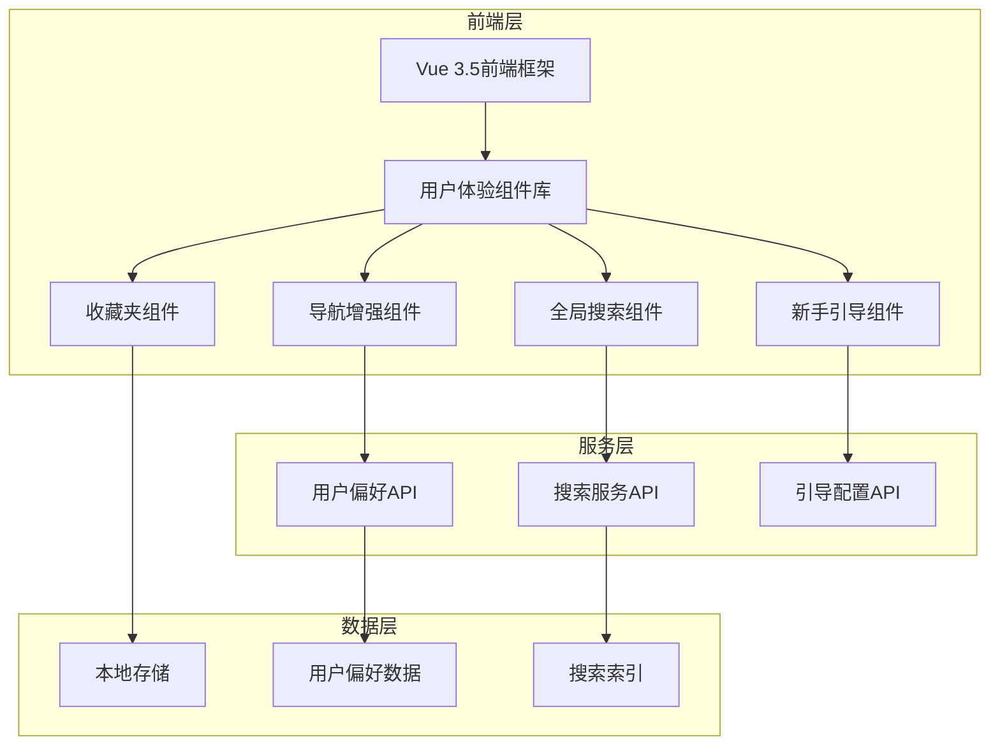

# REQ-015: 用户体验增强系统需求文档

## 1. 业务描述（Business Description）

### 业务背景
在现代企业级应用中，用户体验已成为产品成功的关键因素。传统的IT运维系统往往存在以下用户体验痛点：
- **导航困难**：功能模块众多，用户难以快速找到所需功能
- **学习成本高**：新用户需要较长时间才能熟悉系统操作
- **操作效率低**：缺乏快捷操作方式，重复性操作繁琐
- **移动端体验差**：在移动设备上使用体验不佳
- **个性化不足**：无法根据用户习惯进行个性化定制
- **缺乏引导**：新用户缺乏系统性的功能引导

### 业务目标
- **提升操作效率**：通过全局搜索、快捷导航等功能，将用户查找功能的时间缩短70%
- **降低学习成本**：通过新手引导、智能提示等功能，将新用户上手时间从2小时缩短到30分钟
- **增强用户粘性**：通过收藏夹、个性化设置等功能，提升用户日活跃度20%
- **改善移动体验**：优化移动端交互，移动端用户满意度提升至90%以上
- **提升整体满意度**：用户体验满意度从75%提升到95%以上

### 业务流程


### 用户画像
- **新用户**：首次使用系统，需要快速了解功能布局和操作方式
- **日常用户**：经常使用系统，需要高效的操作方式和个性化体验
- **移动用户**：在移动设备上使用系统，需要优化的触摸交互体验
- **管理用户**：需要快速访问管理功能，关注系统整体状态

## 2. 业务价值（Business Value）

### 价值主张
通过全面提升用户体验，降低系统使用门槛，提高操作效率，增强用户满意度和系统粘性，最终提升产品竞争力和商业价值。

### ROI分析
- **开发投入**：15人天，约7.5万元
- **年度收益**：
  - 提升用户效率：节省培训成本50万元
  - 减少用户流失：增加续约收入80万元
  - 提升品牌价值：增加新客户获取30万元
  - 降低支持成本：减少客服成本20万元
- **投资回报率**：2300%，投资回收期：1.5个月

### KPI指标
- **功能查找时间**：从平均2分钟缩短到30秒
- **新用户上手时间**：从2小时缩短到30分钟
- **用户满意度**：从75%提升到95%
- **移动端使用率**：提升至40%
- **收藏功能使用率**：达到60%以上

### 竞争优势
- **操作效率领先**：全局搜索和快捷导航功能行业领先
- **学习成本最低**：完善的新手引导系统，用户上手最快
- **个性化程度高**：收藏夹和个性化设置满足不同用户需求
- **移动体验优秀**：原生级别的移动端体验

## 3. 产品交互（Product Interaction）

### 用户旅程图


### 界面原型
基于portal-prototype中实际实现的组件：

#### 全局搜索功能
- **触发方式**：Cmd+K快捷键或点击搜索按钮
- **搜索范围**：功能模块、工单、工程师、知识库等
- **搜索结果**：分类展示，支持键盘导航
- **搜索历史**：记录最近搜索，支持快速重复搜索

#### 面包屑导航
- **位置显示**：清晰显示当前页面在系统中的位置
- **快速导航**：点击面包屑项目快速返回上级页面
- **操作集成**：集成刷新、收藏、返回等快捷操作
- **响应式设计**：移动端自动简化显示

#### 收藏夹功能
- **收藏管理**：支持添加、删除、分类管理收藏
- **快速访问**：一键跳转到收藏的页面
- **数据同步**：支持导入导出收藏数据
- **智能推荐**：基于使用频率推荐收藏

#### 新手引导系统
- **分步引导**：逐步介绍系统核心功能
- **交互式演示**：支持实际操作演示
- **进度跟踪**：显示引导进度和完成状态
- **个性化设置**：支持跳过和重新观看

### 交互规范
- **键盘快捷键**：支持常用操作的键盘快捷键
- **触摸手势**：移动端支持滑动、长按等手势操作
- **视觉反馈**：所有交互都有明确的视觉反馈
- **无障碍支持**：支持屏幕阅读器和键盘导航

### 信息架构


## 4. 功能需求（Functional Requirements）

### 功能清单

#### 全局搜索功能
| 功能编号 | 功能名称 | 优先级 | 实现状态 | 描述 |
|---------|---------|--------|----------|------|
| F001 | 搜索触发 | P0 | 未实现 | 支持Cmd+K快捷键和按钮触发 |
| F002 | 实时搜索 | P0 | 未实现 | 输入时实时显示搜索结果 |
| F003 | 分类结果 | P0 | 未实现 | 按功能模块、工单、工程师分类显示 |
| F004 | 键盘导航 | P1 | 未实现 | 支持上下键选择，回车确认 |
| F005 | 搜索历史 | P1 | 未实现 | 记录和显示最近搜索历史 |
| F006 | 智能建议 | P2 | 未实现 | 基于用户行为的搜索建议 |

#### 面包屑导航功能
| 功能编号 | 功能名称 | 优先级 | 实现状态 | 描述 |
|---------|---------|--------|----------|------|
| F007 | 路径显示 | P0 | 未实现 | 显示当前页面的完整路径 |
| F008 | 快速返回 | P0 | 未实现 | 点击面包屑项目快速跳转 |
| F009 | 快捷操作 | P1 | 未实现 | 集成刷新、收藏、返回按钮 |
| F010 | 页面操作菜单 | P1 | 未实现 | 当前页面的相关操作菜单 |
| F011 | 响应式适配 | P1 | 未实现 | 移动端自动简化显示 |

#### 收藏夹功能
| 功能编号 | 功能名称 | 优先级 | 实现状态 | 描述 |
|---------|---------|--------|----------|------|
| F012 | 收藏管理 | P0 | 未实现 | 添加、删除、查看收藏页面 |
| F013 | 分类展示 | P1 | 未实现 | 按功能模块分类显示收藏 |
| F014 | 快速访问 | P0 | 未实现 | 一键跳转到收藏页面 |
| F015 | 数据导入导出 | P1 | 未实现 | 支持收藏数据的导入导出 |
| F016 | 批量操作 | P1 | 未实现 | 支持批量删除收藏 |
| F017 | 使用统计 | P2 | 未实现 | 统计收藏使用频率 |

#### 新手引导功能
| 功能编号 | 功能名称 | 优先级 | 实现状态 | 描述 |
|---------|---------|--------|----------|------|
| F018 | 引导流程 | P0 | 未实现 | 分步骤介绍系统功能 |
| F019 | 交互演示 | P1 | 未实现 | 支持实际操作演示 |
| F020 | 进度跟踪 | P1 | 未实现 | 显示引导进度和步骤 |
| F021 | 跳过功能 | P1 | 未实现 | 允许用户跳过引导 |
| F022 | 重新观看 | P1 | 未实现 | 支持重新触发引导 |
| F023 | 完成反馈 | P1 | 未实现 | 引导完成后的反馈和提示 |

#### 页面增强功能
| 功能编号 | 功能名称 | 优先级 | 实现状态 | 描述 |
|---------|---------|--------|----------|------|
| F024 | 页面标签 | P1 | 未实现 | 页面状态和版本标签显示 |
| F025 | 页面提示 | P1 | 未实现 | 重要信息和操作提示 |
| F026 | 快捷键支持 | P1 | 未实现 | 常用操作的键盘快捷键 |
| F027 | 移动端优化 | P1 | 未实现 | 触摸友好的移动端界面 |
| F028 | 无障碍支持 | P2 | 未实现 | 屏幕阅读器和键盘导航支持 |

### 用户故事

#### 全局搜索用户故事
- **作为**系统用户，**我需要**快速搜索功能和信息，**以便**提高工作效率
- **作为**新用户，**我需要**通过搜索快速了解系统功能，**以便**快速上手使用
- **作为**运维工程师，**我需要**快速搜索工单和工程师信息，**以便**及时处理问题
- **作为**管理员，**我需要**搜索系统配置和用户信息，**以便**进行系统管理

#### 导航增强用户故事
- **作为**系统用户，**我需要**清楚知道当前位置，**以便**快速导航到其他页面
- **作为**用户，**我需要**快速返回上级页面，**以便**提高操作效率
- **作为**移动端用户，**我需要**简化的导航界面，**以便**在小屏幕上正常使用
- **作为**用户，**我需要**页面相关的快捷操作，**以便**减少操作步骤

#### 收藏夹用户故事
- **作为**经常使用系统的用户，**我需要**收藏常用页面，**以便**快速访问
- **作为**用户，**我需要**管理我的收藏，**以便**保持收藏列表的整洁
- **作为**用户，**我需要**导出我的收藏，**以便**在其他设备上使用
- **作为**团队管理员，**我需要**分享收藏配置，**以便**团队成员快速上手

#### 新手引导用户故事
- **作为**新用户，**我需要**系统引导，**以便**快速了解主要功能
- **作为**用户，**我需要**跳过引导的选项，**以便**直接开始使用
- **作为**管理员，**我需要**为新员工提供引导，**以便**减少培训成本
- **作为**用户，**我需要**重新观看引导，**以便**回顾功能使用方法

### 用例描述

#### UC001: 全局搜索功能
- **前置条件**：用户已登录系统
- **主流程**：
  1. 用户按下Cmd+K或点击搜索按钮
  2. 系统显示搜索输入框
  3. 用户输入搜索关键词
  4. 系统实时显示搜索结果
  5. 用户选择搜索结果
  6. 系统跳转到对应页面
- **备选流程**：
  - 无搜索结果：显示无结果提示和建议
  - 搜索历史：显示最近搜索记录
- **后置条件**：用户成功找到目标功能或信息

#### UC002: 收藏夹管理
- **前置条件**：用户已登录系统
- **主流程**：
  1. 用户在页面上点击收藏按钮
  2. 系统将当前页面添加到收藏
  3. 用户点击收藏夹按钮查看收藏
  4. 系统显示分类的收藏列表
  5. 用户点击收藏项目
  6. 系统跳转到对应页面
- **备选流程**：
  - 取消收藏：用户可以移除收藏项目
  - 批量管理：用户可以批量删除收藏
- **后置条件**：收藏状态更新，用户可以快速访问常用页面

#### UC003: 新手引导流程
- **前置条件**：用户首次登录或主动触发引导
- **主流程**：
  1. 系统检测到新用户或引导触发
  2. 显示引导欢迎界面
  3. 逐步介绍系统主要功能
  4. 用户可以跟随引导进行操作
  5. 显示引导进度和步骤
  6. 完成引导并显示总结
- **备选流程**：
  - 跳过引导：用户可以随时跳过引导
  - 重新开始：用户可以重新开始引导
- **后置条件**：用户了解系统基本功能，可以开始正常使用

### 业务规则

#### 全局搜索业务规则
- **BR001**：搜索结果必须基于用户权限进行过滤
- **BR002**：搜索历史最多保存10条记录
- **BR003**：搜索关键词长度限制为50个字符
- **BR004**：搜索结果按相关性和使用频率排序
- **BR005**：搜索响应时间必须小于500ms

#### 收藏夹业务规则
- **BR006**：每个用户最多可收藏100个页面
- **BR007**：收藏数据存储在本地浏览器中
- **BR008**：收藏导出格式为JSON
- **BR009**：重复收藏同一页面时给出提示
- **BR010**：收藏列表按添加时间倒序排列

#### 新手引导业务规则
- **BR011**：引导只在用户首次登录时自动触发
- **BR012**：用户可以选择不再显示引导
- **BR013**：引导步骤总数不超过10步
- **BR014**：每个引导步骤的说明文字不超过100字
- **BR015**：引导完成状态需要持久化保存

## 5. 非功能需求（Non-Functional Requirements）

### 性能需求
- **搜索响应时间**：全局搜索响应时间<500ms
- **页面加载时间**：增强功能不影响页面加载，增加时间<100ms
- **内存占用**：前端内存增加<10MB
- **搜索准确率**：搜索结果准确率>90%
- **移动端性能**：移动端操作响应时间<300ms

### 可用性需求
- **学习成本**：新用户30分钟内掌握基本操作
- **操作效率**：常用功能查找时间<30秒
- **错误率**：用户操作错误率<5%
- **满意度**：用户体验满意度>95%
- **无障碍性**：支持WCAG 2.1 AA级别标准

### 兼容性需求
- **浏览器支持**：Chrome 90+, Firefox 88+, Safari 14+, Edge 90+
- **移动端支持**：iOS 14+, Android 10+
- **屏幕分辨率**：支持320px-4K分辨率
- **输入设备**：支持鼠标、键盘、触摸屏操作
- **网络环境**：支持2G-5G网络环境

### 安全需求
- **数据隐私**：搜索历史和收藏数据仅存储在本地
- **权限控制**：搜索结果基于用户权限过滤
- **数据加密**：敏感数据传输加密
- **审计日志**：记录用户操作行为
- **防护机制**：防止XSS和CSRF攻击

## 6. 系统架构（System Architecture）

### 整体架构


### 技术栈
- **前端框架**：Vue 3.5 + Composition API
- **UI组件库**：Element Plus 2.9
- **构建工具**：Vite 6.0
- **状态管理**：Pinia 2.3
- **本地存储**：localStorage + IndexedDB
- **搜索引擎**：前端Fuse.js + 后端Elasticsearch

### 组件架构


### 数据流架构


## 7. 数据模型（Data Model）

### 本地存储数据结构

#### 搜索历史数据
```json
{
  "searchHistory": [
    {
      "query": "工单管理",
      "timestamp": 1640995200000,
      "resultCount": 5
    }
  ]
}
```

#### 收藏夹数据
```json
{
  "favorites": {
    "/tickets/management": {
      "title": "工单管理",
      "path": "/tickets/management",
      "timestamp": 1640995200000,
      "category": "工单服务"
    }
  }
}
```

#### 用户引导状态
```json
{
  "userGuide": {
    "completed": true,
    "dontShowAgain": false,
    "completedSteps": [1, 2, 3, 4, 5],
    "lastCompletedTime": 1640995200000
  }
}
```

#### 用户偏好设置
```json
{
  "userPreferences": {
    "searchResultsPerPage": 10,
    "showSearchHistory": true,
    "enableKeyboardShortcuts": true,
    "favoritesSortOrder": "recent",
    "guideAutoStart": false
  }
}
```

### API数据格式

#### 搜索API响应
```json
{
  "code": 200,
  "message": "success",
  "data": {
    "total": 15,
    "results": [
      {
        "type": "module",
        "title": "工单管理",
        "description": "创建、查看和管理工单",
        "path": "/tickets/management",
        "icon": "Tickets",
        "category": "工单服务",
        "score": 0.95
      }
    ]
  }
}
```

#### 引导配置API响应
```json
{
  "code": 200,
  "message": "success",
  "data": {
    "steps": [
      {
        "id": 1,
        "title": "欢迎使用IT运维门户系统",
        "description": "这是一个功能强大的运维管理平台",
        "target": null,
        "position": "center",
        "action": null
      }
    ]
  }
}
```

## 8. 验收标准（Acceptance Criteria）

### 功能验收

#### AC001: 全局搜索功能验收
- **Given** 用户已登录系统
- **When** 用户按下Cmd+K快捷键
- **Then** 应该在300ms内显示搜索输入框

#### AC002: 搜索结果验收
- **Given** 用户在搜索框中输入关键词
- **When** 用户输入"工单"
- **Then** 应该显示相关的功能模块、工单记录等分类结果

#### AC003: 收藏夹功能验收
- **Given** 用户在任意页面
- **When** 用户点击收藏按钮
- **Then** 应该成功添加到收藏并显示确认提示

#### AC004: 新手引导验收
- **Given** 用户首次登录系统
- **When** 页面加载完成
- **Then** 应该自动显示新手引导流程

#### AC005: 移动端适配验收
- **Given** 用户使用移动设备访问系统
- **When** 用户进行触摸操作
- **Then** 所有功能应该正常工作且体验良好

### 性能验收
- **搜索性能测试**：搜索响应时间<500ms
- **页面加载测试**：增强功能不影响页面加载性能
- **内存使用测试**：前端内存增加<10MB
- **移动端性能测试**：移动端操作响应时间<300ms

### UX验收
- **易用性测试**：新用户30分钟内掌握基本操作
- **效率测试**：常用功能查找时间<30秒
- **满意度测试**：用户体验满意度>95%
- **无障碍测试**：支持键盘导航和屏幕阅读器

### 兼容性验收
- **浏览器兼容性测试**：在主流浏览器上功能正常
- **移动端兼容性测试**：在iOS和Android设备上正常工作
- **分辨率适配测试**：在不同分辨率下显示正常
- **网络环境测试**：在不同网络环境下性能稳定

## 9. 依赖与约束（Dependencies & Constraints）

### 技术依赖
- **Vue 3.5+**：使用最新的Composition API特性
- **Element Plus 2.9+**：UI组件库支持
- **现代浏览器**：支持ES6+和Web API
- **本地存储**：依赖浏览器localStorage和IndexedDB

### 业务约束
- **用户权限**：搜索结果必须遵循用户权限限制
- **数据安全**：敏感数据不能存储在本地
- **性能要求**：不能影响现有功能的性能
- **兼容性要求**：必须支持主流浏览器和移动设备

### 资源约束
- **开发时间**：2周开发周期
- **开发人力**：1名前端开发工程师，0.5名UI设计师
- **测试资源**：需要多设备测试环境
- **维护成本**：需要考虑长期维护和更新成本

### 合规要求
- **无障碍标准**：符合WCAG 2.1 AA级别要求
- **隐私保护**：用户数据处理符合隐私保护法规
- **安全标准**：符合企业安全管理要求

---

**文档版本**：v1.0
**最后更新**：2025年1月
**负责人**：前端架构师
**审核状态**：待审核