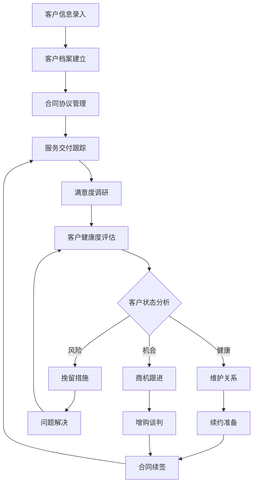
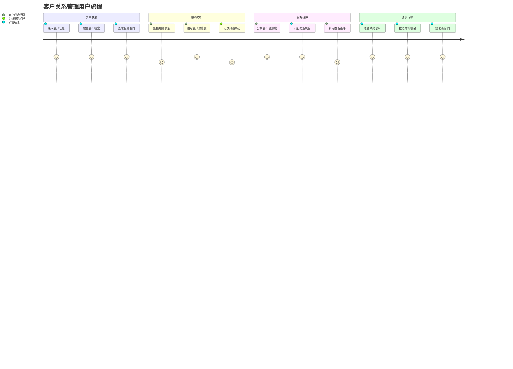
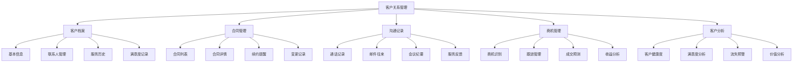
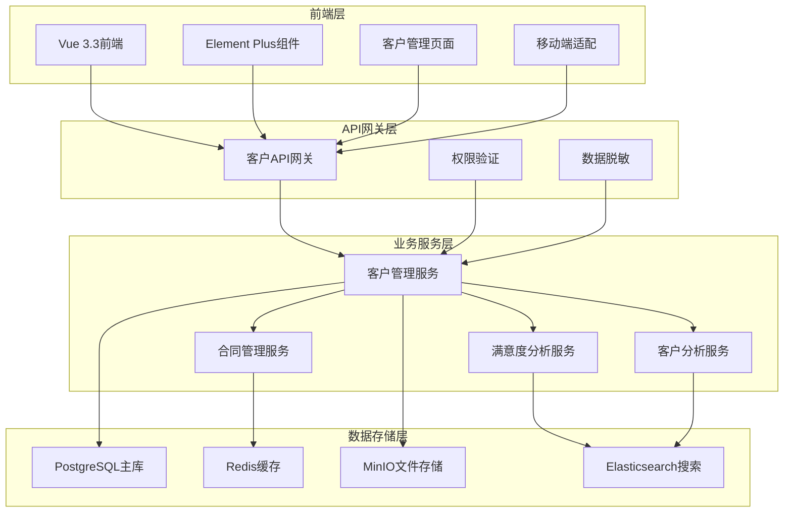
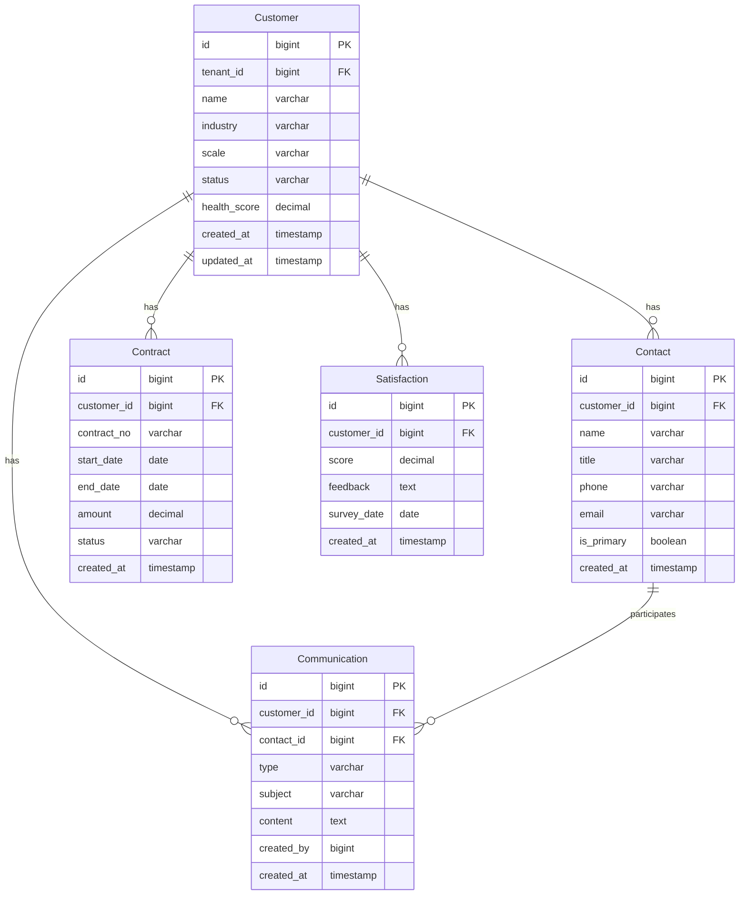

# REQ-016: 客户关系管理模块需求文档

## 1. 业务描述（Business Description）

### 业务背景
在多租户IT运维服务场景中，客户关系管理是商业化运营的核心环节，传统客户管理存在以下关键痛点：
- **客户信息分散**：客户信息散落在各个系统中，缺乏统一的客户视图
- **服务历史难追溯**：客户服务历史记录不完整，影响服务连续性
- **满意度难量化**：缺乏系统化的客户满意度跟踪和分析机制
- **商机识别困难**：无法有效识别续约、增购等商业机会
- **客户流失风险高**：缺乏客户健康度监控和预警机制
- **沟通效率低下**：客户沟通记录分散，团队协作效率低

### 业务目标
- **客户视图统一化**：建立360度客户全景视图，整合所有客户相关信息
- **服务质量提升**：通过客户历史分析，提供个性化和精准化服务
- **客户满意度提升**：客户满意度从75%提升到92%以上
- **客户续约率提升**：客户续约率从80%提升到95%以上
- **商业机会挖掘**：识别并转化30%以上的增购和续约机会
- **客户流失率降低**：客户流失率降低50%以上

### 业务流程


### 用户画像
- **销售经理**：管理客户关系，跟进商业机会，制定销售策略
- **客户成功经理**：监控客户健康度，提升客户满意度，预防客户流失
- **运维服务经理**：了解客户服务历史，优化服务交付质量
- **高级管理层**：查看客户分析报告，制定客户战略和业务决策

## 2. 业务价值（Business Value）

### 价值主张
通过构建全面的客户关系管理系统，实现客户全生命周期管理，提升客户体验和满意度，增强客户粘性，挖掘商业价值，为企业可持续发展提供强有力的客户基础。

### ROI分析
- **开发投入**：15人天，约7.5万元
- **年度收益**：
  - 客户续约收益：300万元（续约率提升15%）
  - 增购收益：150万元（识别并转化增购机会）
  - 客户获取成本节省：80万元（提升客户推荐率）
  - 服务效率提升：100万元（个性化服务减少重复工作）
- **投资回报率**：8300%，投资回收期：1.5周

### KPI指标
- **客户满意度**：>92%（目标值），当前75%
- **客户续约率**：>95%（目标值），当前80%
- **客户流失率**：<3%（目标值），当前6%
- **客户生命周期价值**：提升40%
- **商机转化率**：>30%
- **客户推荐率(NPS)**：>50

### 竞争优势
- **360度客户视图**：整合所有客户相关数据，提供完整客户画像
- **智能客户分析**：基于AI的客户健康度评估和商机识别
- **个性化服务**：基于客户历史和偏好的个性化服务推荐
- **预测性分析**：客户流失预警和续约概率预测
- **移动端支持**：随时随地的客户信息访问和更新

## 3. 产品交互（Product Interaction）

### 用户旅程图


### 界面原型
- **客户档案页面**：基本信息、联系人、合同历史、服务记录
- **客户仪表板**：客户健康度、满意度趋势、商机状态、关键指标
- **沟通记录页面**：通话记录、邮件往来、会议纪要、服务反馈
- **商机管理页面**：商机列表、跟进状态、预期收益、成交概率

### 交互规范
- **实时数据更新**：客户信息和状态实时同步，延迟<10秒
- **智能提醒**：基于客户行为和时间节点的智能提醒
- **快速操作**：一键拨号、邮件发送、会议安排等快捷操作
- **移动端适配**：完美适配手机和平板设备的客户管理

### 信息架构


## 4. 功能需求（Functional Requirements）

### 功能清单
| 功能编号 | 功能名称 | 优先级 | 实现状态 | 描述 |
|---------|---------|--------|----------|------|
| F001 | 客户档案管理 | P0 | ❌未实现 | 客户基本信息、联系人、组织架构管理 |
| F002 | 合同协议管理 | P0 | ❌未实现 | 合同录入、续约提醒、变更跟踪 |
| F003 | 沟通记录管理 | P0 | ❌未实现 | 通话、邮件、会议记录管理 |
| F004 | 客户满意度跟踪 | P0 | ❌未实现 | 满意度调研、趋势分析、预警 |
| F005 | 客户健康度评估 | P1 | ❌未实现 | 基于多维度数据的健康度评分 |
| F006 | 商机识别管理 | P1 | ❌未实现 | 续约、增购机会识别和跟进 |
| F007 | 客户分析报告 | P1 | ❌未实现 | 客户价值、流失风险分析报告 |
| F008 | 客户标签管理 | P1 | ❌未实现 | 客户分类标签、智能标签推荐 |
| F009 | 客户服务历史 | P1 | ❌未实现 | 工单历史、服务记录整合展示 |
| F010 | 移动端客户管理 | P2 | ❌未实现 | 移动端客户信息查看和更新 |

### 用户故事
- **作为**销售经理，**我需要**查看客户的完整档案和服务历史，**以便**制定个性化的销售策略
- **作为**客户成功经理，**我需要**监控客户健康度和满意度趋势，**以便**及时发现和解决客户问题
- **作为**运维服务经理，**我需要**了解客户的服务偏好和历史问题，**以便**提供更好的服务体验
- **作为**高级管理层，**我需要**查看客户分析报告和商业机会，**以便**制定客户战略和业务决策

### 用例描述
#### UC001: 创建客户档案
- **前置条件**：用户已登录，拥有客户管理权限
- **主流程**：
  1. 用户点击"新建客户"按钮
  2. 填写客户基本信息（公司名称、行业、规模等）
  3. 添加主要联系人信息
  4. 设置客户标签和分类
  5. 上传相关文档（营业执照、授权书等）
  6. 保存客户档案
- **备选流程**：
  - 客户已存在：提示重复，建议合并或更新
  - 必填信息缺失：高亮显示缺失字段
- **后置条件**：客户档案创建成功，可进行后续管理

#### UC002: 客户健康度评估
- **前置条件**：客户档案已存在，有服务数据
- **主流程**：
  1. 系统自动收集客户相关数据
  2. 基于多维度指标计算健康度评分
  3. 生成健康度报告和趋势图
  4. 识别风险因素和改进建议
  5. 发送健康度报告给相关人员
- **备选流程**：
  - 数据不足：提示需要补充的数据类型
  - 评估异常：人工审核和调整
- **后置条件**：客户健康度更新，触发相应的预警或机会

### 业务规则
- **BR001**：每个客户必须有至少一个主要联系人
- **BR002**：客户健康度评估每周自动更新一次
- **BR003**：合同到期前90天自动发送续约提醒
- **BR004**：客户满意度低于70%时自动触发预警
- **BR005**：客户档案变更需要记录变更历史和原因

## 5. 非功能需求（Non-Functional Requirements）

### 性能需求
- **响应时间**：客户档案加载<1秒，客户搜索<500ms
- **并发支持**：支持200+用户同时访问客户信息
- **数据处理**：支持10万+客户档案的快速检索和分析
- **报告生成**：客户分析报告生成时间<30秒
- **移动端性能**：移动端页面加载<2秒

### 可用性需求
- **系统可用性**：99.5%以上
- **数据一致性**：客户信息实时同步，一致性>99.9%
- **故障恢复**：客户数据自动备份，故障恢复时间<5分钟
- **离线支持**：移动端支持离线查看客户基本信息

### 可扩展性需求
- **客户规模**：支持10万+客户档案管理
- **数据存储**：支持TB级客户相关数据存储
- **功能扩展**：支持自定义客户字段和业务流程
- **集成扩展**：预留CRM、ERP等外部系统集成接口

### 安全需求
- **数据隔离**：多租户客户数据完全隔离
- **权限控制**：基于角色的客户信息访问控制
- **敏感信息保护**：客户敏感信息加密存储
- **操作审计**：完整的客户信息操作审计日志
- **数据脱敏**：非授权用户查看脱敏后的客户信息

## 6. 系统架构（System Architecture）

### 整体架构


### 技术栈
- **前端技术**：Vue 3.3 + Element Plus 2.3 + Pinia 2.1
- **后端框架**：Spring Boot 3.2 + Java 17
- **数据库**：PostgreSQL 15 + Druid连接池
- **缓存**：Redis 7.0
- **搜索引擎**：Elasticsearch 8.0
- **文件存储**：MinIO
- **消息队列**：RabbitMQ 3.12

### 部署架构
- **微服务部署**：客户管理服务独立部署，支持水平扩展
- **数据库集群**：PostgreSQL主从复制，读写分离
- **缓存集群**：Redis集群，支持高可用
- **负载均衡**：Nginx负载均衡，支持高并发

### 集成架构
- **内部集成**：与工单系统、知识库、报表系统深度集成
- **外部集成**：支持主流CRM、ERP系统数据同步
- **API开放**：提供标准REST API供第三方系统调用

## 7. 数据模型（Data Model）

### 实体关系图


### API规范
#### 获取客户列表
- **URL**：`GET /api/v1/customers`
- **请求参数**：
  ```json
  {
    "page": 1,
    "size": 20,
    "keyword": "string",
    "industry": "string",
    "status": "string"
  }
  ```
- **响应格式**：
  ```json
  {
    "code": 200,
    "message": "success",
    "data": {
      "total": 100,
      "items": [
        {
          "id": 1,
          "name": "客户名称",
          "industry": "制造业",
          "healthScore": 85.5,
          "status": "active"
        }
      ]
    }
  }
  ```

### 数据字典
| 字段名 | 类型 | 长度 | 是否必填 | 默认值 | 说明 |
|--------|------|------|----------|--------|------|
| id | bigint | - | 是 | - | 主键ID |
| tenant_id | bigint | - | 是 | - | 租户ID |
| name | varchar | 200 | 是 | - | 客户名称 |
| industry | varchar | 100 | 否 | - | 所属行业 |
| scale | varchar | 50 | 否 | - | 企业规模 |
| status | varchar | 20 | 是 | active | 客户状态 |
| health_score | decimal | 5,2 | 否 | 0 | 健康度评分 |

## 8. 验收标准（Acceptance Criteria）

### 功能验收
#### AC001: 客户档案管理
- **Given** 用户具有客户管理权限
- **When** 创建新客户档案并填写完整信息
- **Then** 客户档案保存成功，可以正常查看和编辑

#### AC002: 客户健康度评估
- **Given** 客户有足够的服务数据
- **When** 系统执行健康度评估
- **Then** 生成准确的健康度评分和分析报告

### 性能验收
- **负载测试**：200用户同时访问，响应时间<1秒
- **压力测试**：10万客户数据下系统稳定运行
- **容量测试**：支持TB级客户数据存储和查询

### UX验收
- **易用性测试**：新用户10分钟内完成客户档案创建
- **兼容性测试**：支持主流浏览器和移动设备
- **响应式测试**：适配不同屏幕尺寸

### 安全验收
- **权限测试**：验证角色权限控制有效性
- **数据隔离测试**：验证多租户客户数据隔离
- **敏感信息测试**：验证客户敏感信息保护

## 9. 依赖与约束（Dependencies & Constraints）

### 模块依赖
- **REQ-001**：基础架构与认证系统（强依赖）
- **REQ-003**：工单管理系统（数据集成）
- **REQ-007**：甲方管理与报表系统（功能整合）
- **REQ-011**：通知与消息系统（消息推送）

### 技术约束
- **数据库**：必须支持多租户数据隔离
- **API设计**：遵循RESTful设计规范
- **安全要求**：符合等保三级安全要求
- **性能要求**：支持大规模客户数据处理

### 业务约束
- **合规要求**：符合客户数据保护法规
- **集成要求**：与现有系统无缝集成
- **用户体验**：保持与现有系统一致的交互体验

---

**文档版本**：v1.0
**最后更新**：2025-01-09
**负责人**：产品经理
**审核状态**：待审核
