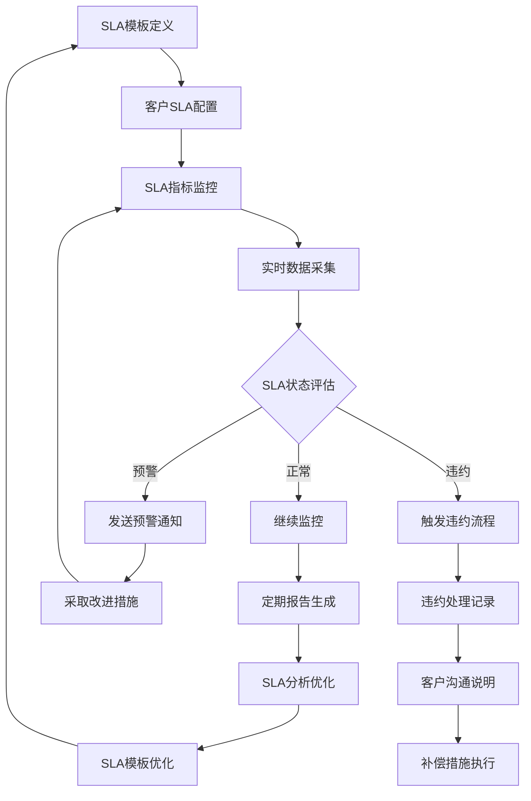
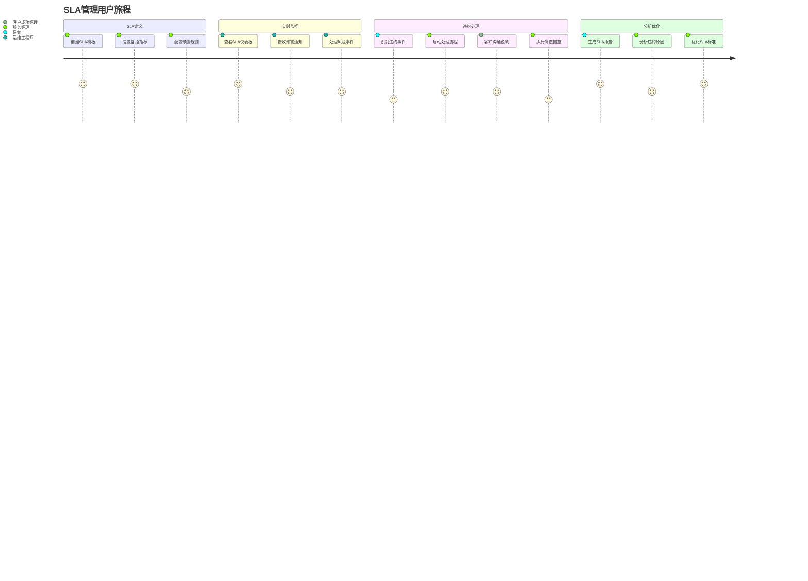
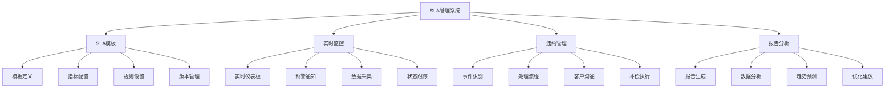
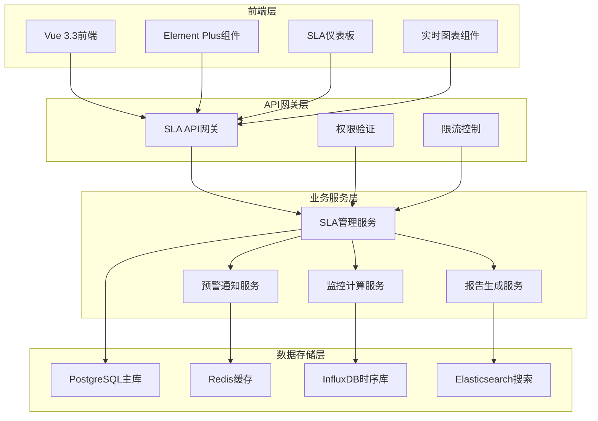
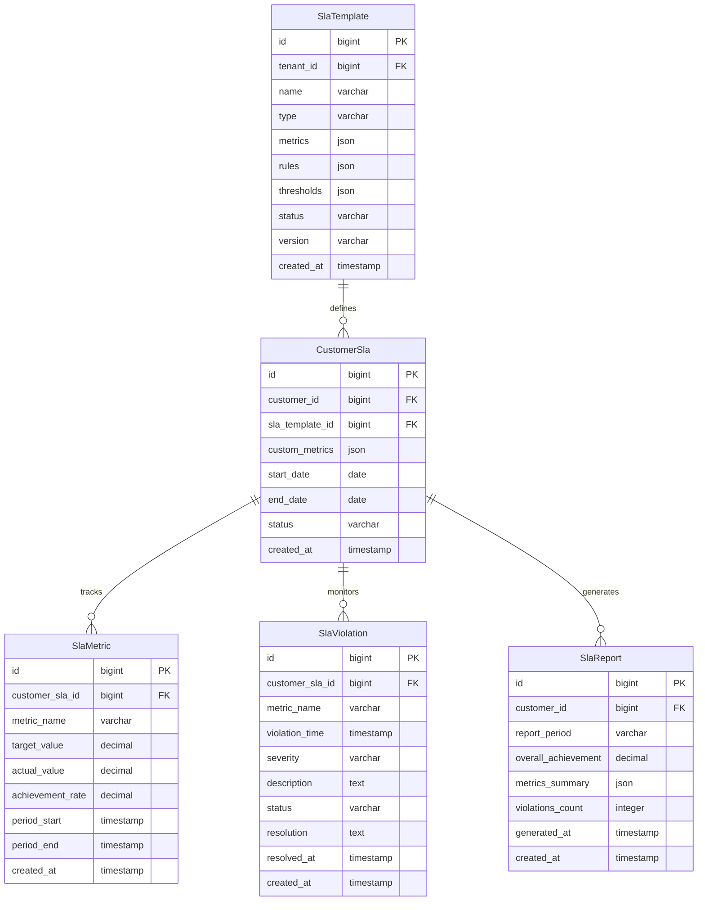

# REQ-017: 服务等级协议管理模块需求文档

## 1. 业务描述（Business Description）

### 业务背景
在多租户IT运维服务场景中，服务等级协议(SLA)管理是确保服务质量和客户满意度的关键环节，传统SLA管理存在以下痛点：
- **SLA标准不统一**：缺乏标准化的SLA模板和指标体系，服务标准参差不齐
- **监控能力不足**：无法实时监控SLA达成情况，问题发现滞后
- **违约处理被动**：SLA违约后才发现问题，缺乏预警机制
- **报告生成困难**：SLA报告需要人工整理，效率低且容易出错
- **持续改进困难**：缺乏SLA数据分析，无法有效优化服务流程
- **客户透明度不足**：客户无法实时了解SLA达成情况，信任度低

### 业务目标
- **SLA标准化**：建立统一的SLA模板和指标体系，确保服务标准一致性
- **实时监控**：实现SLA指标的实时监控和自动化跟踪
- **预警机制**：SLA违约风险预警，提前采取措施避免违约
- **达成率提升**：SLA达成率从70%提升到95%以上
- **客户满意度提升**：通过透明的SLA管理提升客户信任度
- **持续优化**：基于SLA数据分析持续优化服务流程

### 业务流程


### 用户画像
- **服务经理**：定义SLA标准，监控达成情况，处理违约事件
- **运维工程师**：关注SLA指标，确保服务质量符合要求
- **客户成功经理**：向客户报告SLA达成情况，处理客户关切
- **高级管理层**：查看SLA整体表现，制定服务改进策略

## 2. 业务价值（Business Value）

### 价值主张
通过建立完善的SLA管理体系，实现服务质量的标准化、可视化和可控化，提升客户信任度和满意度，降低服务风险，为企业建立可持续的竞争优势。

### ROI分析
- **开发投入**：12人天，约6万元
- **年度收益**：
  - 违约成本节省：200万元（减少SLA违约赔偿）
  - 客户满意度提升：150万元（提升客户续约率）
  - 运营效率提升：100万元（自动化监控和报告）
  - 品牌价值提升：80万元（提升市场竞争力）
- **投资回报率**：8700%，投资回收期：1.5周

### KPI指标
- **SLA达成率**：>95%（目标值），当前70%
- **违约事件数量**：减少80%
- **客户投诉率**：减少60%
- **SLA报告生成效率**：提升90%
- **预警响应时间**：<15分钟
- **客户满意度**：>92%

### 竞争优势
- **实时透明**：客户可实时查看SLA达成情况，提升信任度
- **智能预警**：基于AI的SLA违约风险预测和预警
- **自动化管理**：全流程自动化的SLA监控和报告
- **持续优化**：基于数据分析的SLA标准持续优化
- **行业领先**：建立行业领先的SLA管理最佳实践

## 3. 产品交互（Product Interaction）

### 用户旅程图


### 界面原型
- **SLA仪表板**：实时监控、达成率统计、预警信息、趋势分析
- **SLA模板管理**：模板定义、指标配置、规则设置、版本管理
- **违约事件管理**：事件列表、处理流程、沟通记录、补偿跟踪
- **SLA报告中心**：报告生成、数据分析、趋势预测、改进建议

### 交互规范
- **实时更新**：SLA指标实时刷新，数据延迟<30秒
- **智能预警**：多级预警机制，颜色编码风险等级
- **一键操作**：快速处理违约事件，一键生成报告
- **移动端支持**：关键SLA指标移动端实时查看

### 信息架构


## 4. 功能需求（Functional Requirements）

### 功能清单
| 功能编号 | 功能名称 | 优先级 | 实现状态 | 描述 |
|---------|---------|--------|----------|------|
| F001 | SLA模板管理 | P0 | ❌未实现 | SLA模板定义、指标配置、规则设置 |
| F002 | 实时监控仪表板 | P0 | ❌未实现 | SLA指标实时监控、状态展示 |
| F003 | 预警通知系统 | P0 | ❌未实现 | SLA风险预警、多渠道通知 |
| F004 | 违约事件管理 | P0 | ❌未实现 | 违约识别、处理流程、记录跟踪 |
| F005 | SLA报告生成 | P1 | ❌未实现 | 自动化报告生成、数据分析 |
| F006 | 客户SLA门户 | P1 | ❌未实现 | 客户查看SLA达成情况 |
| F007 | SLA数据分析 | P1 | ❌未实现 | 趋势分析、根因分析、优化建议 |
| F008 | 补偿管理 | P1 | ❌未实现 | 违约补偿计算、执行跟踪 |
| F009 | SLA基准管理 | P2 | ❌未实现 | 行业基准对比、标准优化 |
| F010 | 移动端SLA监控 | P2 | ❌未实现 | 移动端SLA状态查看 |

### 用户故事
- **作为**服务经理，**我需要**定义标准化的SLA模板，**以便**确保服务标准的一致性
- **作为**运维工程师，**我需要**实时监控SLA达成情况，**以便**及时发现和处理问题
- **作为**客户成功经理，**我需要**向客户透明展示SLA表现，**以便**建立客户信任
- **作为**高级管理层，**我需要**查看SLA整体分析报告，**以便**制定服务改进策略

### 用例描述
#### UC001: 创建SLA模板
- **前置条件**：用户已登录，拥有SLA管理权限
- **主流程**：
  1. 用户选择SLA模板类型（响应时间、解决时间、可用性等）
  2. 定义SLA指标和目标值
  3. 设置监控规则和计算方法
  4. 配置预警阈值和通知规则
  5. 保存并激活SLA模板
- **备选流程**：
  - 指标冲突：提示调整冲突的指标设置
  - 规则无效：验证并提示修正规则
- **后置条件**：SLA模板创建成功，可应用于客户

#### UC002: SLA违约处理
- **前置条件**：系统检测到SLA违约事件
- **主流程**：
  1. 系统自动识别并记录违约事件
  2. 发送违约通知给相关人员
  3. 启动违约处理流程
  4. 分析违约原因并记录
  5. 与客户沟通说明情况
  6. 执行补偿措施（如有）
  7. 更新违约处理状态
- **备选流程**：
  - 误报违约：人工审核并标记为误报
  - 客户争议：启动争议处理流程
- **后置条件**：违约事件处理完成，客户满意度恢复

### 业务规则
- **BR001**：每个客户必须配置至少一个SLA模板
- **BR002**：SLA违约事件必须在2小时内响应
- **BR003**：SLA达成率计算基于自然月统计
- **BR004**：预警通知按照严重程度分级发送
- **BR005**：SLA模板变更需要客户确认并记录版本

## 5. 非功能需求（Non-Functional Requirements）

### 性能需求
- **响应时间**：SLA仪表板加载<2秒，指标查询<500ms
- **实时性**：SLA数据更新延迟<30秒
- **并发支持**：支持500+用户同时查看SLA状态
- **数据处理**：支持百万级SLA事件数据的实时分析
- **报告生成**：SLA报告生成时间<60秒

### 可用性需求
- **系统可用性**：99.9%以上（SLA监控系统本身的可用性）
- **数据准确性**：SLA计算准确率>99.9%
- **故障恢复**：SLA数据自动备份，故障恢复时间<3分钟
- **监控连续性**：7x24小时不间断监控

### 可扩展性需求
- **客户规模**：支持1000+客户的SLA管理
- **指标扩展**：支持自定义SLA指标和计算规则
- **集成扩展**：支持与监控系统、工单系统的深度集成
- **报告扩展**：支持自定义报告模板和格式

### 安全需求
- **数据隔离**：多租户SLA数据完全隔离
- **权限控制**：基于角色的SLA信息访问控制
- **操作审计**：完整的SLA操作审计日志
- **数据完整性**：SLA数据防篡改和完整性校验

## 6. 系统架构（System Architecture）

### 整体架构


### 技术栈
- **前端技术**：Vue 3.3 + Element Plus 2.3 + ECharts 5.4
- **后端框架**：Spring Boot 3.2 + Java 17
- **数据库**：PostgreSQL 15 + InfluxDB 2.0（时序数据）
- **缓存**：Redis 7.0
- **搜索引擎**：Elasticsearch 8.0
- **消息队列**：RabbitMQ 3.12
- **监控集成**：Prometheus + Grafana

### 部署架构
- **微服务部署**：SLA服务独立部署，支持水平扩展
- **时序数据库**：InfluxDB集群，专门存储SLA监控数据
- **实时计算**：基于流处理的实时SLA计算
- **高可用设计**：多节点部署，故障自动切换

### 集成架构
- **工单系统集成**：实时获取工单处理数据
- **监控系统集成**：获取系统可用性和性能数据
- **通知系统集成**：多渠道SLA预警通知
- **报表系统集成**：SLA数据纳入综合报表

## 7. 数据模型（Data Model）

### 实体关系图


### API规范
#### 获取SLA仪表板数据
- **URL**：`GET /api/v1/sla/dashboard`
- **请求参数**：
  ```json
  {
    "customerId": "bigint",
    "period": "string",
    "metrics": ["string"]
  }
  ```
- **响应格式**：
  ```json
  {
    "code": 200,
    "message": "success",
    "data": {
      "overallAchievement": 95.5,
      "metrics": [
        {
          "name": "响应时间",
          "target": 30,
          "actual": 25.5,
          "achievement": 98.2,
          "status": "normal"
        }
      ],
      "violations": 2,
      "trends": []
    }
  }
  ```

### 数据字典
| 字段名 | 类型 | 长度 | 是否必填 | 默认值 | 说明 |
|--------|------|------|----------|--------|------|
| id | bigint | - | 是 | - | 主键ID |
| tenant_id | bigint | - | 是 | - | 租户ID |
| name | varchar | 100 | 是 | - | SLA模板名称 |
| type | varchar | 50 | 是 | - | SLA类型 |
| metrics | json | - | 是 | - | SLA指标定义 |
| achievement_rate | decimal | 5,2 | 否 | 0 | 达成率 |
| severity | varchar | 20 | 是 | - | 违约严重程度 |

## 8. 验收标准（Acceptance Criteria）

### 功能验收
#### AC001: SLA模板管理
- **Given** 用户具有SLA管理权限
- **When** 创建新SLA模板并配置指标
- **Then** 模板保存成功，可应用于客户

#### AC002: 实时SLA监控
- **Given** 客户已配置SLA模板
- **When** 系统运行并产生监控数据
- **Then** SLA仪表板实时显示达成情况

#### AC003: SLA违约预警
- **Given** SLA指标接近违约阈值
- **When** 系统检测到风险
- **Then** 自动发送预警通知给相关人员

### 性能验收
- **负载测试**：500用户同时访问，响应时间<2秒
- **实时性测试**：数据更新延迟<30秒
- **准确性测试**：SLA计算准确率>99.9%

### UX验收
- **易用性测试**：新用户15分钟内完成SLA模板创建
- **可视化测试**：SLA仪表板直观展示关键指标
- **移动端测试**：移动端正常查看SLA状态

### 安全验收
- **权限测试**：验证SLA数据访问权限控制
- **数据隔离测试**：验证多租户SLA数据隔离
- **审计测试**：验证SLA操作审计日志完整性

## 9. 依赖与约束（Dependencies & Constraints）

### 模块依赖
- **REQ-001**：基础架构与认证系统（强依赖）
- **REQ-003**：工单管理系统（数据集成）
- **REQ-011**：通知与消息系统（预警通知）
- **REQ-016**：客户关系管理模块（客户信息）

### 技术约束
- **时序数据库**：需要InfluxDB支持高频时序数据
- **实时计算**：需要流处理能力支持实时SLA计算
- **监控集成**：需要与现有监控系统深度集成
- **报告生成**：需要支持复杂的SLA报告模板

### 业务约束
- **SLA标准**：需要符合行业SLA管理最佳实践
- **客户协议**：SLA变更需要客户确认
- **合规要求**：SLA数据需要满足审计要求

---

**文档版本**：v1.0
**最后更新**：2025-01-09
**负责人**：产品经理
**审核状态**：待审核
