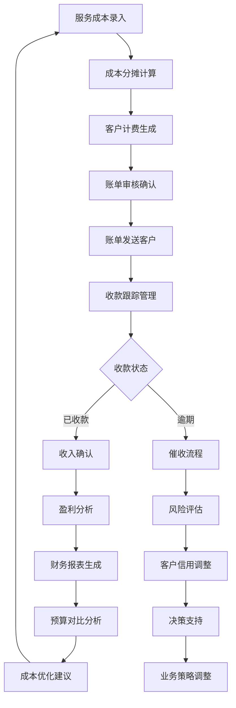
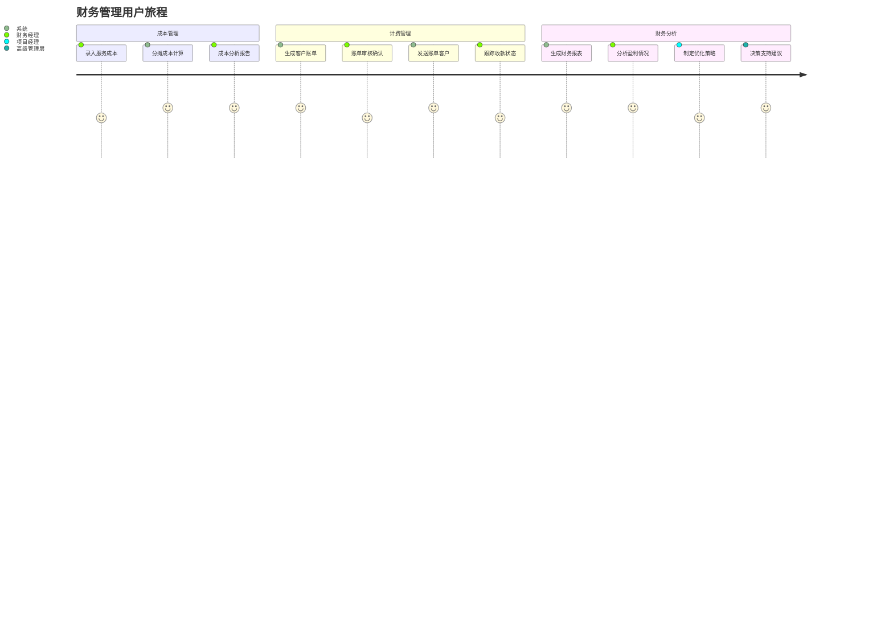
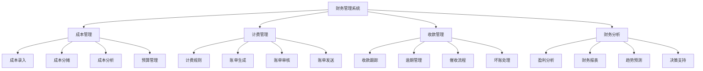
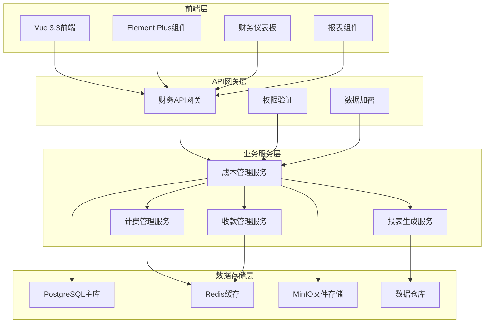
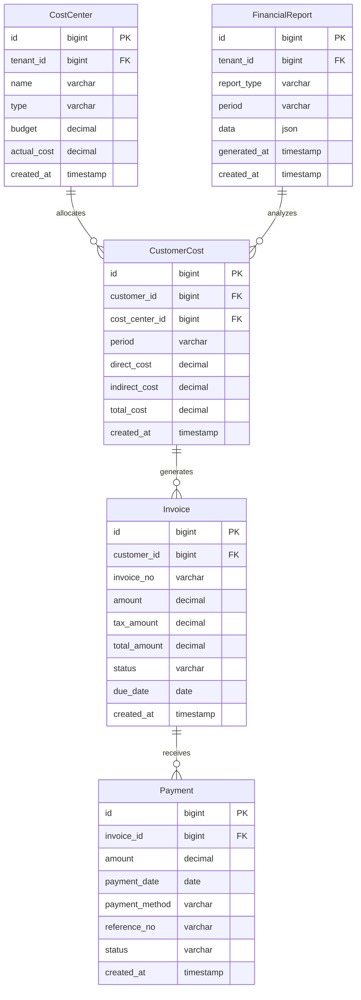

# REQ-018: 财务管理模块需求文档

## 1. 业务描述（Business Description）

### 业务背景
在多租户IT运维服务场景中，财务管理是商业化运营的核心支撑，传统财务管理存在以下关键痛点：
- **成本核算困难**：无法精确核算每个客户的服务成本，盈利分析不准确
- **计费流程复杂**：人工计费效率低，容易出错，客户争议多
- **财务数据分散**：财务数据散落在各个系统，缺乏统一的财务视图
- **预算控制不足**：缺乏有效的预算管理和成本控制机制
- **盈利分析滞后**：无法实时了解项目和客户的盈利情况
- **合规风险高**：财务流程不规范，存在合规和审计风险

### 业务目标
- **成本精确核算**：实现客户级、项目级的精确成本核算
- **计费自动化**：自动化计费流程，提升效率90%，减少错误率95%
- **盈利能力提升**：通过精确的成本分析，提升整体盈利能力20%
- **预算控制强化**：建立有效的预算管理体系，成本控制在预算范围内
- **财务透明化**：为管理层提供实时的财务分析和决策支持
- **合规性保障**：建立规范的财务流程，满足审计和合规要求

### 业务流程


### 用户画像
- **财务经理**：负责财务核算、报表生成、预算管理和成本控制
- **项目经理**：关注项目成本和盈利情况，进行项目财务管理
- **销售经理**：了解客户盈利能力，制定定价策略
- **高级管理层**：查看财务分析报告，制定财务战略和业务决策

## 2. 业务价值（Business Value）

### 价值主张
通过建立完善的财务管理体系，实现成本的精确核算、收入的规范管理和盈利的持续优化，为企业提供强有力的财务支撑和决策依据，确保商业化运营的成功。

### ROI分析
- **开发投入**：18人天，约9万元
- **年度收益**：
  - 成本控制收益：250万元（精确成本核算，减少浪费）
  - 计费效率提升：120万元（自动化计费，减少人工成本）
  - 盈利优化收益：200万元（基于数据的盈利优化）
  - 风险控制收益：80万元（减少坏账和财务风险）
- **投资回报率**：7100%，投资回收期：2周

### KPI指标
- **成本核算准确率**：>98%
- **计费自动化率**：>95%
- **账单争议率**：<2%
- **收款及时率**：>90%
- **成本控制率**：预算偏差<5%
- **盈利分析及时性**：月度报告T+3天内完成

### 竞争优势
- **精确成本核算**：基于活动的成本核算(ABC)，精确到客户和项目
- **智能财务分析**：基于AI的财务数据分析和预测
- **实时财务监控**：实时的财务指标监控和预警
- **灵活计费模式**：支持多种计费模式和定价策略
- **合规性保障**：符合财务会计准则和税务要求

## 3. 产品交互（Product Interaction）

### 用户旅程图


### 界面原型
- **财务仪表板**：收入支出概览、盈利趋势、预算执行、关键指标
- **成本管理页面**：成本录入、分摊规则、成本分析、预算对比
- **计费管理页面**：账单生成、审核流程、发送跟踪、收款管理
- **财务报表中心**：报表模板、数据分析、趋势预测、导出功能

### 交互规范
- **实时数据更新**：财务数据实时同步，延迟<1分钟
- **智能计算**：自动化的成本分摊和计费计算
- **审批流程**：可配置的财务审批工作流
- **数据安全**：财务敏感数据的加密和权限控制

### 信息架构


## 4. 功能需求（Functional Requirements）

### 功能清单
| 功能编号 | 功能名称 | 优先级 | 实现状态 | 描述 |
|---------|---------|--------|----------|------|
| F001 | 成本核算管理 | P0 | ❌未实现 | 人力、设备、运营成本核算 |
| F002 | 客户计费管理 | P0 | ❌未实现 | 自动化计费、账单生成 |
| F003 | 收款跟踪管理 | P0 | ❌未实现 | 收款状态跟踪、逾期提醒 |
| F004 | 财务报表生成 | P0 | ❌未实现 | 损益表、现金流、资产负债表 |
| F005 | 预算管理 | P1 | ❌未实现 | 预算制定、执行监控、偏差分析 |
| F006 | 盈利分析 | P1 | ❌未实现 | 客户盈利、项目盈利分析 |
| F007 | 成本分摊规则 | P1 | ❌未实现 | 灵活的成本分摊规则配置 |
| F008 | 财务审批流程 | P1 | ❌未实现 | 可配置的财务审批工作流 |
| F009 | 税务管理 | P2 | ❌未实现 | 税务计算、申报支持 |
| F010 | 财务数据分析 | P2 | ❌未实现 | 基于AI的财务数据分析 |

### 用户故事
- **作为**财务经理，**我需要**精确核算每个客户的服务成本，**以便**制定合理的定价策略
- **作为**项目经理，**我需要**实时了解项目的盈利情况，**以便**优化项目执行
- **作为**销售经理，**我需要**了解客户的盈利能力，**以便**制定差异化的销售策略
- **作为**高级管理层，**我需要**查看财务分析报告，**以便**制定财务战略和业务决策

### 用例描述
#### UC001: 客户成本核算
- **前置条件**：已有客户服务数据和成本数据
- **主流程**：
  1. 系统收集客户相关的服务数据
  2. 根据成本分摊规则计算直接成本
  3. 分摊间接成本到客户
  4. 生成客户成本明细报告
  5. 计算客户盈利率
- **备选流程**：
  - 数据缺失：提示补充必要的成本数据
  - 规则冲突：人工审核和调整
- **后置条件**：客户成本核算完成，可用于定价决策

#### UC002: 自动化计费
- **前置条件**：客户已配置计费规则
- **主流程**：
  1. 系统根据服务使用情况收集计费数据
  2. 应用客户的计费规则计算费用
  3. 生成客户账单
  4. 发送账单给财务审核
  5. 审核通过后发送给客户
- **备选流程**：
  - 计费异常：标记异常并人工处理
  - 审核不通过：修正后重新提交
- **后置条件**：账单生成并发送，进入收款跟踪

### 业务规则
- **BR001**：成本核算必须基于实际发生的费用
- **BR002**：账单生成后24小时内必须完成审核
- **BR003**：逾期账款超过30天自动进入催收流程
- **BR004**：财务数据变更必须有审批记录
- **BR005**：月度财务报表必须在月末后3个工作日内完成

## 5. 非功能需求（Non-Functional Requirements）

### 性能需求
- **响应时间**：财务报表生成<30秒，成本计算<10秒
- **并发支持**：支持100+用户同时进行财务操作
- **数据处理**：支持千万级财务交易数据的处理和分析
- **计算准确性**：财务计算精度达到小数点后2位
- **批量处理**：支持万级账单的批量生成和处理

### 可用性需求
- **系统可用性**：99.9%以上
- **数据一致性**：财务数据强一致性，无数据丢失
- **故障恢复**：财务数据实时备份，故障恢复时间<5分钟
- **事务完整性**：确保财务事务的ACID特性

### 可扩展性需求
- **客户规模**：支持1000+客户的财务管理
- **交易量**：支持每月百万级财务交易处理
- **报表扩展**：支持自定义财务报表模板
- **集成扩展**：支持与ERP、银行系统的集成

### 安全需求
- **数据隔离**：多租户财务数据完全隔离
- **权限控制**：基于角色的财务数据访问控制
- **数据加密**：财务敏感数据加密存储和传输
- **操作审计**：完整的财务操作审计日志
- **合规性**：符合财务会计准则和税务法规

## 6. 系统架构（System Architecture）

### 整体架构


### 技术栈
- **前端技术**：Vue 3.3 + Element Plus 2.3 + ECharts 5.4
- **后端框架**：Spring Boot 3.2 + Java 17
- **数据库**：PostgreSQL 15 + Druid连接池
- **缓存**：Redis 7.0
- **数据仓库**：ClickHouse（财务数据分析）
- **文件存储**：MinIO
- **消息队列**：RabbitMQ 3.12

### 部署架构
- **微服务部署**：财务服务独立部署，支持水平扩展
- **数据库集群**：PostgreSQL主从复制，读写分离
- **数据仓库**：ClickHouse集群，支持大数据分析
- **高可用设计**：多节点部署，故障自动切换

### 集成架构
- **内部集成**：与客户管理、工单系统、SLA管理深度集成
- **外部集成**：支持银行系统、税务系统、ERP系统集成
- **API开放**：提供标准财务API供第三方系统调用

## 7. 数据模型（Data Model）

### 实体关系图


### API规范
#### 生成客户账单
- **URL**：`POST /api/v1/finance/invoices`
- **请求参数**：
  ```json
  {
    "customerId": "bigint",
    "period": "2025-01",
    "items": [
      {
        "description": "string",
        "quantity": "decimal",
        "unitPrice": "decimal",
        "amount": "decimal"
      }
    ]
  }
  ```
- **响应格式**：
  ```json
  {
    "code": 200,
    "message": "success",
    "data": {
      "invoiceId": 12345,
      "invoiceNo": "INV-2025-001",
      "totalAmount": 10000.00,
      "dueDate": "2025-02-15"
    }
  }
  ```

### 数据字典
| 字段名 | 类型 | 长度 | 是否必填 | 默认值 | 说明 |
|--------|------|------|----------|--------|------|
| id | bigint | - | 是 | - | 主键ID |
| tenant_id | bigint | - | 是 | - | 租户ID |
| customer_id | bigint | - | 是 | - | 客户ID |
| amount | decimal | 15,2 | 是 | 0 | 金额 |
| status | varchar | 20 | 是 | draft | 状态 |
| period | varchar | 10 | 是 | - | 会计期间 |

## 8. 验收标准（Acceptance Criteria）

### 功能验收
#### AC001: 成本核算
- **Given** 有完整的服务成本数据
- **When** 执行客户成本核算
- **Then** 生成准确的成本分摊报告

#### AC002: 自动化计费
- **Given** 客户已配置计费规则
- **When** 系统执行自动计费
- **Then** 生成正确的客户账单

#### AC003: 财务报表生成
- **Given** 有足够的财务数据
- **When** 生成月度财务报表
- **Then** 报表数据准确且符合会计准则

### 性能验收
- **负载测试**：100用户同时操作，响应时间<10秒
- **数据处理测试**：千万级数据处理正常
- **计算准确性测试**：财务计算精度达到要求

### UX验收
- **易用性测试**：财务人员30分钟内掌握基本操作
- **报表测试**：财务报表格式规范，数据清晰
- **审批流程测试**：审批流程顺畅，状态清晰

### 安全验收
- **权限测试**：验证财务数据访问权限控制
- **数据加密测试**：验证敏感财务数据加密
- **审计测试**：验证财务操作审计日志完整性

## 9. 依赖与约束（Dependencies & Constraints）

### 模块依赖
- **REQ-001**：基础架构与认证系统（强依赖）
- **REQ-016**：客户关系管理模块（客户信息）
- **REQ-017**：SLA管理模块（服务数据）
- **REQ-003**：工单管理系统（服务成本数据）

### 技术约束
- **数据精度**：财务计算必须精确到分
- **事务处理**：必须支持分布式事务
- **数据仓库**：需要支持大数据分析
- **合规性**：必须符合财务会计准则

### 业务约束
- **会计准则**：必须符合企业会计准则
- **税务法规**：必须符合税务法规要求
- **审计要求**：必须满足内外部审计要求
- **数据保留**：财务数据需要长期保存

---

**文档版本**：v1.0
**最后更新**：2025-01-09
**负责人**：产品经理
**审核状态**：待审核
