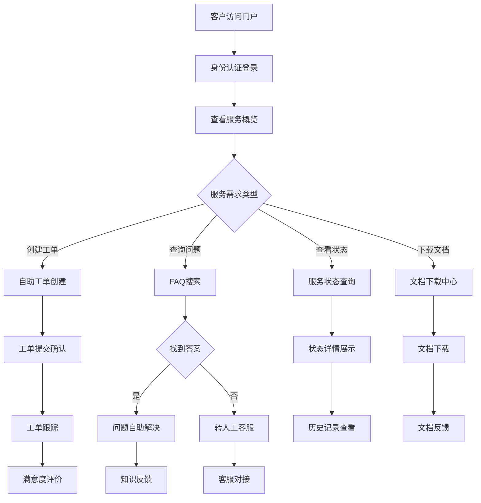
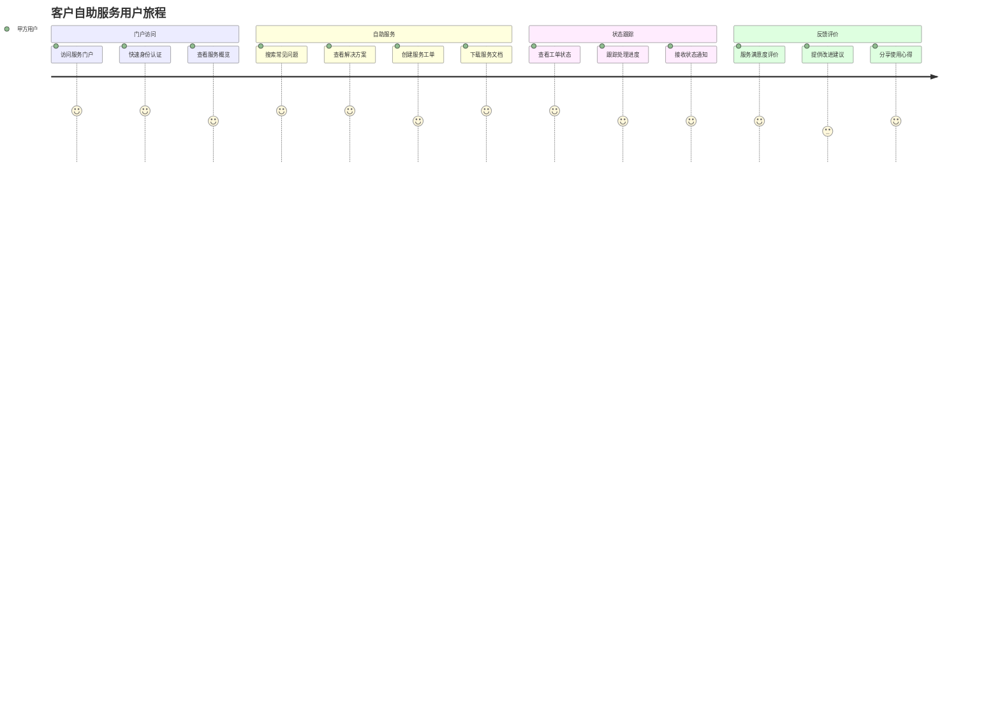
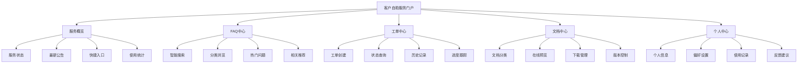
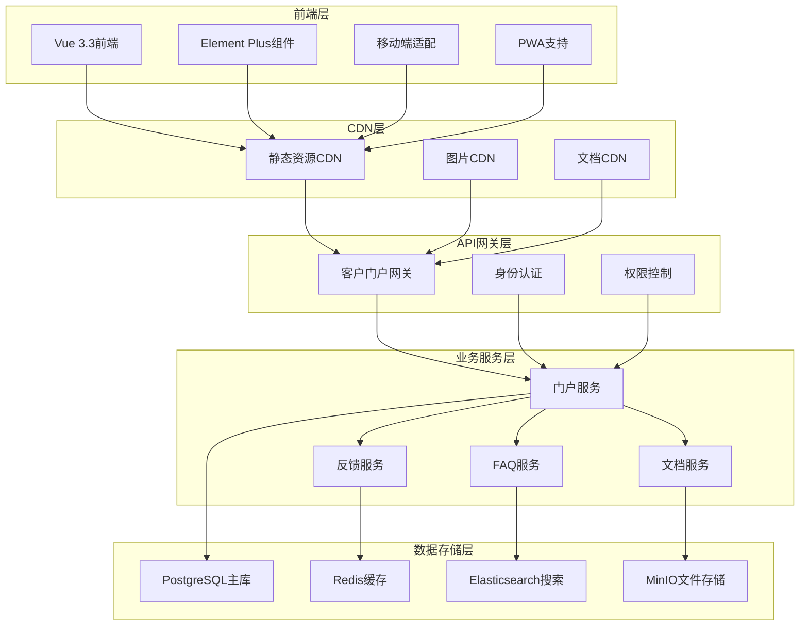
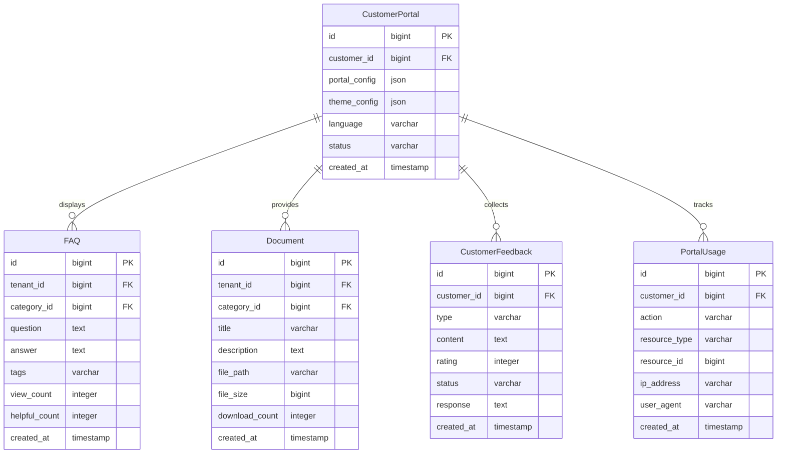

# REQ-019: 客户自助服务门户需求文档

## 1. 业务描述（Business Description）

### 业务背景
在多租户IT运维服务场景中，客户自助服务门户是提升客户体验和降低服务成本的重要手段，传统客户服务存在以下痛点：
- **服务时间受限**：客户只能在工作时间获得服务支持，影响业务连续性
- **沟通成本高**：简单问题也需要人工客服，增加服务成本
- **信息获取困难**：客户难以快速获取所需的服务信息和文档
- **服务透明度不足**：客户无法自主查看服务状态和历史记录
- **重复性问题多**：相同问题重复咨询，浪费双方时间
- **客户体验不佳**：等待时间长，问题解决效率低

### 业务目标
- **7x24自助服务**：提供全天候的客户自助服务能力
- **服务成本降低**：减少人工客服压力，降低服务成本40%
- **客户满意度提升**：客户满意度从75%提升到88%
- **问题解决效率**：常见问题自助解决率达到70%
- **服务透明度提升**：客户可实时查看服务状态和进度
- **知识共享促进**：通过FAQ和知识库促进知识共享

### 业务流程


### 用户画像
- **甲方IT管理员**：需要快速解决技术问题，查看服务状态
- **甲方业务用户**：需要简单易用的服务请求和问题解决
- **甲方管理层**：需要了解服务概况和历史记录
- **客服人员**：需要了解客户自助服务使用情况

## 2. 业务价值（Business Value）

### 价值主张
通过构建专业的客户自助服务门户，提供7x24小时的自助服务能力，提升客户体验和满意度，降低服务成本，增强客户粘性，为企业创造可持续的竞争优势。

### ROI分析
- **开发投入**：10人天，约5万元
- **年度收益**：
  - 人工成本节省：150万元（减少客服人工成本）
  - 客户满意度提升：100万元（提升客户续约率）
  - 服务效率提升：80万元（提升问题解决效率）
  - 知识价值实现：50万元（知识库价值变现）
- **投资回报率**：7500%，投资回收期：2周

### KPI指标
- **自助解决率**：>70%
- **客户满意度**：>88%（目标值），当前75%
- **门户使用率**：>80%的客户活跃使用
- **问题解决时间**：自助问题平均解决时间<5分钟
- **FAQ命中率**：>60%
- **文档下载量**：月均下载量>1000次

### 竞争优势
- **全天候服务**：7x24小时不间断的自助服务
- **智能搜索**：基于AI的智能问题搜索和推荐
- **个性化体验**：基于客户历史的个性化服务推荐
- **移动友好**：完美适配移动设备的自助服务
- **多语言支持**：支持多语言的国际化服务

## 3. 产品交互（Product Interaction）

### 用户旅程图


### 界面原型
- **门户首页**：服务概览、快捷入口、最新公告、常用功能
- **FAQ中心**：智能搜索、分类浏览、热门问题、相关推荐
- **工单中心**：工单创建、状态查询、历史记录、进度跟踪
- **文档中心**：文档分类、在线预览、下载管理、版本控制

### 交互规范
- **响应式设计**：完美适配桌面、平板、手机等设备
- **智能搜索**：支持自然语言搜索和智能推荐
- **快速导航**：清晰的导航结构和面包屑导航
- **实时反馈**：操作结果的实时反馈和状态提示

### 信息架构


## 4. 功能需求（Functional Requirements）

### 功能清单
| 功能编号 | 功能名称 | 优先级 | 实现状态 | 描述 |
|---------|---------|--------|----------|------|
| F001 | 客户门户首页 | P0 | ❌未实现 | 服务概览、快捷入口、公告展示 |
| F002 | 智能FAQ系统 | P0 | ❌未实现 | 智能搜索、分类浏览、问题推荐 |
| F003 | 自助工单创建 | P0 | ❌未实现 | 工单模板、在线创建、状态跟踪 |
| F004 | 服务状态查询 | P0 | ❌未实现 | 实时状态、历史记录、进度跟踪 |
| F005 | 文档下载中心 | P1 | ❌未实现 | 文档分类、在线预览、下载管理 |
| F006 | 客户反馈系统 | P1 | ❌未实现 | 满意度评价、建议收集、反馈跟踪 |
| F007 | 个人中心管理 | P1 | ❌未实现 | 个人信息、偏好设置、使用记录 |
| F008 | 移动端适配 | P1 | ❌未实现 | 响应式设计、移动端优化 |
| F009 | 多语言支持 | P2 | ❌未实现 | 中英文切换、国际化支持 |
| F010 | 智能客服机器人 | P2 | ❌未实现 | AI客服、自动回复、人工转接 |

### 用户故事
- **作为**甲方用户，**我需要**快速找到常见问题的解决方案，**以便**自助解决问题
- **作为**甲方用户，**我需要**方便地创建和跟踪工单，**以便**及时获得技术支持
- **作为**甲方用户，**我需要**下载相关的技术文档，**以便**更好地使用系统
- **作为**甲方管理层，**我需要**查看服务概况和历史记录，**以便**评估服务质量

### 用例描述
#### UC001: 智能FAQ搜索
- **前置条件**：用户已登录客户门户
- **主流程**：
  1. 用户在搜索框输入问题关键词
  2. 系统进行智能搜索和匹配
  3. 展示相关的FAQ条目和解决方案
  4. 用户查看详细的解决步骤
  5. 用户对答案进行评价反馈
- **备选流程**：
  - 无匹配结果：推荐相关问题或转人工客服
  - 答案不满意：提供反馈渠道和人工客服
- **后置条件**：问题得到解决或转入人工处理

#### UC002: 自助工单创建
- **前置条件**：用户已登录且有工单创建权限
- **主流程**：
  1. 用户选择工单类型和模板
  2. 填写工单详细信息
  3. 上传相关附件（可选）
  4. 确认并提交工单
  5. 系统生成工单号并发送确认
- **备选流程**：
  - 信息不完整：提示补充必要信息
  - 重复工单：提示查看已有工单
- **后置条件**：工单创建成功，进入处理流程

### 业务规则
- **BR001**：客户只能查看和操作自己的工单和数据
- **BR002**：FAQ搜索结果按相关度和热度排序
- **BR003**：文档下载需要记录下载日志
- **BR004**：客户反馈必须在24小时内响应
- **BR005**：门户访问需要进行身份认证和权限验证

## 5. 非功能需求（Non-Functional Requirements）

### 性能需求
- **响应时间**：页面加载<3秒，搜索响应<1秒
- **并发支持**：支持1000+客户同时访问门户
- **搜索性能**：FAQ搜索支持万级条目的快速检索
- **文件下载**：支持大文件下载，断点续传
- **移动端性能**：移动端页面加载<2秒

### 可用性需求
- **系统可用性**：99.5%以上
- **易用性**：新用户5分钟内完成基本操作
- **兼容性**：支持主流浏览器和移动设备
- **无障碍性**：符合Web无障碍访问标准

### 可扩展性需求
- **用户规模**：支持万级客户用户访问
- **内容扩展**：支持FAQ和文档的动态扩展
- **功能扩展**：支持新功能模块的快速集成
- **多租户扩展**：支持多租户的个性化门户

### 安全需求
- **身份认证**：支持多种认证方式（SSO、LDAP等）
- **数据隔离**：客户数据完全隔离，防止越权访问
- **传输安全**：HTTPS加密传输，防止数据泄露
- **操作审计**：完整的用户操作审计日志

## 6. 系统架构（System Architecture）

### 整体架构


### 技术栈
- **前端技术**：Vue 3.3 + Element Plus 2.3 + Vite 5.0
- **移动端**：响应式设计 + PWA
- **后端框架**：Spring Boot 3.2 + Java 17
- **数据库**：PostgreSQL 15 + Redis 7.0
- **搜索引擎**：Elasticsearch 8.0
- **文件存储**：MinIO + CDN
- **缓存策略**：多级缓存（浏览器、CDN、Redis）

### 部署架构
- **前端部署**：静态资源CDN分发，全球加速
- **后端部署**：微服务容器化部署，支持弹性扩缩容
- **数据库部署**：主从复制，读写分离
- **文件存储**：分布式文件存储，支持大文件处理

### 集成架构
- **内部集成**：与工单系统、知识库、客户管理深度集成
- **外部集成**：支持第三方认证系统集成
- **API开放**：提供标准API供移动APP调用

## 7. 数据模型（Data Model）

### 实体关系图


### API规范
#### FAQ搜索接口
- **URL**：`GET /api/v1/portal/faq/search`
- **请求参数**：
  ```json
  {
    "keyword": "string",
    "category": "string",
    "page": 1,
    "size": 10
  }
  ```
- **响应格式**：
  ```json
  {
    "code": 200,
    "message": "success",
    "data": {
      "total": 50,
      "items": [
        {
          "id": 1,
          "question": "如何重置密码？",
          "answer": "详细步骤...",
          "category": "账户管理",
          "helpfulCount": 25
        }
      ]
    }
  }
  ```

### 数据字典
| 字段名 | 类型 | 长度 | 是否必填 | 默认值 | 说明 |
|--------|------|------|----------|--------|------|
| id | bigint | - | 是 | - | 主键ID |
| customer_id | bigint | - | 是 | - | 客户ID |
| question | text | - | 是 | - | FAQ问题 |
| answer | text | - | 是 | - | FAQ答案 |
| view_count | integer | - | 否 | 0 | 查看次数 |
| helpful_count | integer | - | 否 | 0 | 有用评价次数 |

## 8. 验收标准（Acceptance Criteria）

### 功能验收
#### AC001: FAQ智能搜索
- **Given** 用户在FAQ搜索框输入关键词
- **When** 系统执行搜索
- **Then** 返回相关度排序的FAQ结果

#### AC002: 自助工单创建
- **Given** 用户选择工单模板并填写信息
- **When** 提交工单
- **Then** 工单创建成功并生成工单号

#### AC003: 文档下载
- **Given** 用户点击文档下载链接
- **When** 执行下载操作
- **Then** 文件正常下载并记录下载日志

### 性能验收
- **负载测试**：1000用户同时访问，响应时间<3秒
- **搜索性能测试**：万级FAQ搜索响应时间<1秒
- **移动端测试**：移动端页面加载<2秒

### UX验收
- **易用性测试**：新用户5分钟内完成基本操作
- **兼容性测试**：支持主流浏览器和移动设备
- **响应式测试**：适配不同屏幕尺寸

### 安全验收
- **认证测试**：验证用户身份认证机制
- **权限测试**：验证数据访问权限控制
- **数据隔离测试**：验证客户数据隔离

## 9. 依赖与约束（Dependencies & Constraints）

### 模块依赖
- **REQ-001**：基础架构与认证系统（强依赖）
- **REQ-003**：工单管理系统（工单创建）
- **REQ-005**：知识库管理系统（FAQ内容）
- **REQ-016**：客户关系管理模块（客户信息）

### 技术约束
- **响应式设计**：必须支持多设备适配
- **搜索引擎**：需要Elasticsearch支持全文搜索
- **CDN支持**：需要CDN支持静态资源分发
- **PWA支持**：支持渐进式Web应用

### 业务约束
- **品牌一致性**：门户设计需要符合企业品牌形象
- **多语言支持**：需要支持中英文切换
- **无障碍访问**：需要符合Web无障碍访问标准

---

**文档版本**：v1.0
**最后更新**：2025-01-09
**负责人**：产品经理
**审核状态**：待审核
