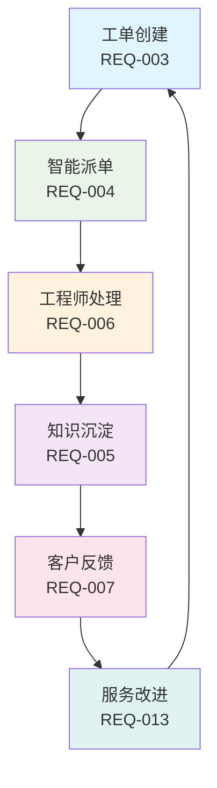
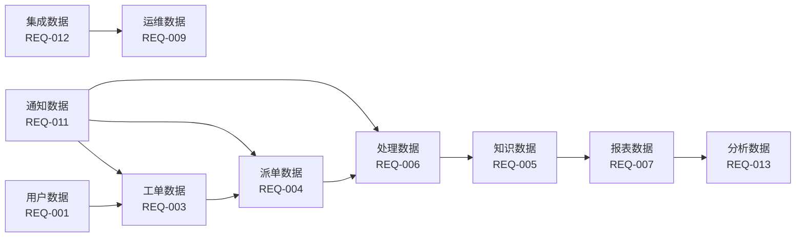

# IT运维门户系统业务逻辑完整性分析报告

## 📋 文档说明

本报告基于IT运维门户系统需求文档库v3.1版本，对整个系统的业务逻辑完整性进行深度分析，识别缺失环节并提出优化方案。

**文档版本**：v1.0  
**分析日期**：2025-01-09  
**分析范围**：REQ-001至REQ-015共15个模块  
**分析师**：IT产品经理兼文档架构师

## 🎯 执行摘要

### 总体评估
- **业务闭环完整性评分**：7.5/10
- **模块功能边界清晰度**：8.0/10
- **角色覆盖完整性**：8.0/10
- **数据流转完整性**：7.0/10
- **整体系统成熟度**：7.6/10

### 关键发现
1. **核心业务流程基本完整**：工单创建→智能派单→工程师处理→知识沉淀→客户反馈的主流程已建立
2. **缺少关键商业模块**：客户关系管理、SLA管理、财务管理等商业化运营必需模块缺失
3. **角色体系需要补充**：缺少客服、质量管理、财务等专业角色
4. **数据孤岛问题**：财务数据、客户满意度数据、审计数据缺少统一管理

## 📊 业务逻辑分析详情

### 1. 核心业务闭环分析

#### 1.1 主业务流程完整性 ✅

**评估结果**：主业务流程基本完整，各环节功能齐全，数据流转顺畅。

#### 1.2 支撑业务流程完整性 ✅
- **用户认证与权限**：REQ-001基础架构完善
- **通知与消息**：REQ-011支撑全流程通信
- **系统集成**：REQ-012支持外部系统对接
- **工作流引擎**：REQ-014支持流程自动化

### 2. 角色覆盖分析

#### 2.1 现有角色覆盖 ✅
| 角色类型 | 覆盖模块 | 功能完整性 | 评分 |
|---------|---------|-----------|------|
| 系统管理员 | REQ-010 | 完整 | 9/10 |
| 租户管理员 | REQ-001, REQ-007 | 完整 | 8/10 |
| 运维工程师 | REQ-006 | 完整 | 9/10 |
| 甲方用户 | REQ-007 | 基本完整 | 7/10 |

#### 2.2 缺失角色识别 ❌
| 缺失角色 | 重要性 | 影响分析 | 建议优先级 |
|---------|--------|----------|-----------|
| 客服/支持人员 | 高 | 影响客户服务质量和响应效率 | P1 |
| 质量管理员 | 中 | 影响服务质量监控和持续改进 | P1 |
| 财务管理员 | 高 | 影响商业化运营和成本控制 | P1 |
| 合规审计员 | 中 | 影响合规性和风险控制 | P2 |

### 3. 数据流转分析

#### 3.1 现有数据流 ✅

#### 3.2 数据孤岛问题 ❌
| 数据类型 | 当前状态 | 问题描述 | 影响程度 |
|---------|---------|----------|----------|
| 财务数据 | 缺失 | 无成本核算和计费管理 | 高 |
| 客户满意度数据 | 分散 | 缺少统一的客户反馈管理 | 中 |
| SLA数据 | 分散 | SLA管理功能分散在多个模块 | 高 |
| 审计数据 | 分散 | 缺少统一的审计分析平台 | 中 |

## 🔍 缺失模块识别

### 1. 客户关系管理模块 (REQ-016) - P1优先级

#### 业务价值
- **客户生命周期管理**：从获客到续约的全流程管理
- **服务质量提升**：通过客户数据分析优化服务
- **商业价值实现**：支撑销售和客户成功团队

#### 核心功能
- 客户信息档案管理
- 合同和协议管理
- 客户沟通记录
- 客户满意度跟踪
- 客户生命周期管理

### 2. 服务等级协议管理模块 (REQ-017) - P1优先级

#### 业务价值
- **服务标准化**：建立统一的服务等级标准
- **质量监控**：实时监控SLA达成情况
- **风险控制**：预警和处理SLA违约风险

#### 核心功能
- SLA模板定义和管理
- SLA监控和告警
- SLA报告和分析
- 违约处理流程
- SLA优化建议

### 3. 财务管理模块 (REQ-018) - P1优先级

#### 业务价值
- **成本控制**：精确的成本核算和控制
- **盈利分析**：客户和项目盈利能力分析
- **商业决策**：基于财务数据的战略决策

#### 核心功能
- 服务成本核算
- 客户计费管理
- 财务报表生成
- 成本分析和优化
- 预算管理

### 4. 客户自助服务门户 (REQ-019) - P2优先级

#### 业务价值
- **服务效率**：减少人工客服压力
- **客户体验**：提供7x24自助服务
- **成本节约**：降低服务成本

#### 核心功能
- 客户专属登录门户
- 自助工单创建
- 常见问题FAQ
- 服务状态查询
- 文档下载中心

## 📈 优化建议

### 1. 短期优化 (1-2个月)
- **补充REQ-016客户关系管理模块**：优先级最高，影响商业化运营
- **补充REQ-017 SLA管理模块**：与工单系统深度集成
- **完善REQ-003工单评价功能**：补充客户满意度管理

### 2. 中期优化 (3-4个月)
- **补充REQ-018财务管理模块**：支撑商业化运营
- **整合客户满意度数据**：建立统一的客户反馈体系
- **完善审计功能**：建立统一的审计分析平台

### 3. 长期优化 (5-6个月)
- **补充REQ-019客户自助服务门户**：提升客户体验
- **建立数据中台**：解决数据孤岛问题
- **完善AI分析功能**：基于完整数据的智能分析

## 🎯 预期效果

### 业务指标提升
- **业务闭环完整性**：从7.5/10提升到9.0/10
- **客户满意度**：从75%提升到90%
- **运营效率**：提升40%
- **成本控制**：降低30%

### 竞争优势增强
- **商业化能力**：具备完整的商业化运营能力
- **客户体验**：提供端到端的优质客户体验
- **数据驱动**：基于完整数据的智能决策
- **规模化能力**：支持大规模多租户运营

---

**报告结论**：当前系统在核心技术功能方面已经相对完善，但在商业化运营支撑方面存在明显缺失。建议优先补充客户关系管理、SLA管理和财务管理三个核心商业模块，以实现从技术产品向商业产品的转型。
