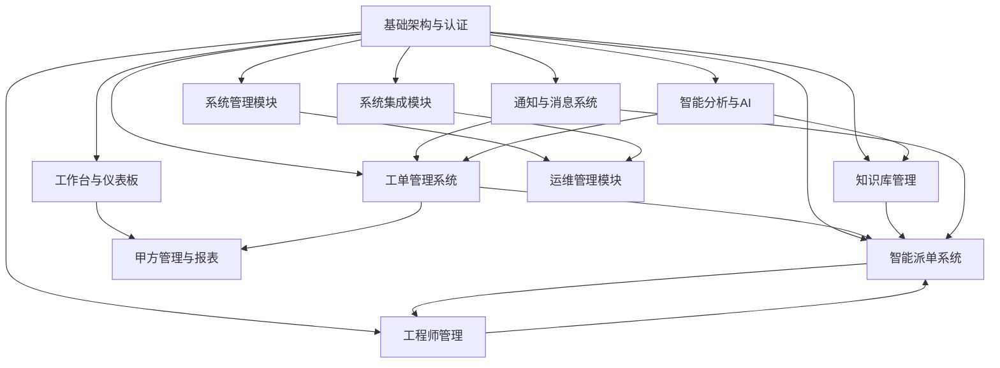

# IT运维门户系统功能模块映射表

## 文档说明
本文档提供前端页面与后端模块的详细映射关系，以及各功能模块的实现状态，为开发团队提供清晰的功能覆盖度和开发指导。

**文档版本**：v3.0  
**最后更新**：2025年7月  
**维护人员**：系统架构师

## 1. 核心业务模块映射

### 1.1 基础架构与认证系统
| 前端页面 | 页面路径 | 后端模块 | API路径 | 实现状态 | 优先级 |
|---------|---------|---------|---------|----------|--------|
| 登录页面 | LoginPage.vue | 认证服务 | /api/v1/auth/login | 未实现 | P0 |
| 个人资料 | ProfilePage.vue | 用户服务 | /api/v1/users/profile | 未实现 | P0 |
| 用户管理 | UserManagement.vue | 用户服务 | /api/v1/users | 未实现 | P0 |
| 系统配置 | SystemConfig.vue | 配置服务 | /api/v1/config | 未实现 | P1 |

### 1.2 工作台与仪表板
| 前端页面 | 页面路径 | 后端模块 | API路径 | 实现状态 | 优先级 |
|---------|---------|---------|---------|----------|--------|
| 运维仪表板 | Dashboard.vue | 仪表板服务 | /api/v1/dashboard | 未实现 | P0 |
| 我的任务 | MyTasks.vue | 任务服务 | /api/v1/tasks | 未实现 | P0 |
| 我的消息 | MyMessages.vue | 消息服务 | /api/v1/messages | 未实现 | P1 |

### 1.3 工单管理系统
| 前端页面 | 页面路径 | 后端模块 | API路径 | 实现状态 | 优先级 |
|---------|---------|---------|---------|----------|--------|
| 工单管理 | TicketDemo.vue | 工单服务 | /api/v1/tickets | 未实现 | P0 |
| 工单详情 | - | 工单服务 | /api/v1/tickets/{id} | 未实现 | P0 |
| 工单统计 | - | 统计服务 | /api/v1/tickets/stats | 未实现 | P1 |

### 1.4 智能派单系统
| 前端页面 | 页面路径 | 后端模块 | API路径 | 实现状态 | 优先级 |
|---------|---------|---------|---------|----------|--------|
| 派单管理 | DispatchDemo.vue | 派单服务 | /api/v1/dispatch | 未实现 | P0 |
| 派单规则 | - | 规则引擎 | /api/v1/dispatch/rules | 未实现 | P0 |
| 派单监控 | - | 监控服务 | /api/v1/dispatch/monitor | 未实现 | P1 |

### 1.5 知识库管理系统
| 前端页面 | 页面路径 | 后端模块 | API路径 | 实现状态 | 优先级 |
|---------|---------|---------|---------|----------|--------|
| 知识库管理 | KnowledgeDemo.vue | 知识库服务 | /api/v1/knowledge | 未实现 | P0 |
| 知识详情 | KnowledgeDemoNew.vue | 知识库服务 | /api/v1/knowledge/{id} | 未实现 | P0 |
| 知识搜索 | - | 搜索服务 | /api/v1/knowledge/search | 未实现 | P1 |

### 1.6 工程师管理系统
| 前端页面 | 页面路径 | 后端模块 | API路径 | 实现状态 | 优先级 |
|---------|---------|---------|---------|----------|--------|
| 工程师管理 | EngineerManagementDemo.vue | 工程师服务 | /api/v1/engineers | 未实现 | P0 |
| 工程师档案 | EngineerProfile.vue | 工程师服务 | /api/v1/engineers/{id} | 未实现 | P0 |
| 技能管理 | SkillManagement.vue | 技能服务 | /api/v1/skills | 未实现 | P1 |
| 排班管理 | ScheduleManagement.vue | 排班服务 | /api/v1/schedules | 未实现 | P1 |
| 培训管理 | TrainingManagement.vue | 培训服务 | /api/v1/training | 未实现 | P2 |
| 考试管理 | ExamManagement.vue | 考试服务 | /api/v1/exams | 未实现 | P2 |
| 绩效管理 | PerformanceDemo.vue | 绩效服务 | /api/v1/performance | 未实现 | P1 |

## 2. 扩展功能模块映射

### 2.1 甲方管理与报表系统
| 前端页面 | 页面路径 | 后端模块 | API路径 | 实现状态 | 优先级 |
|---------|---------|---------|---------|----------|--------|
| 甲方管理 | ClientManagementDemo.vue | 客户服务 | /api/v1/clients | 未实现 | P0 |
| 报表生成 | - | 报表服务 | /api/v1/reports | 未实现 | P1 |

### 2.2 系统管理模块 (REQ-010)
| 前端页面 | 页面路径 | 后端模块 | API路径 | 实现状态 | 优先级 |
|---------|---------|---------|---------|----------|--------|
| 租户管理 | TenantManagementDemo.vue | 租户服务 | /api/v1/tenants | 未实现 | P0 |
| 部门管理 | DepartmentManagementDemo.vue | 部门服务 | /api/v1/departments | 未实现 | P0 |
| 工程师站点管理 | EngineerSiteManagement.vue | 站点服务 | /api/v1/engineer-sites | 未实现 | P1 |
| 工程师租户管理 | EngineerTenantManagement.vue | 租户服务 | /api/v1/engineer-tenants | 未实现 | P1 |

### 2.3 通知与消息系统 (REQ-011)
| 前端页面 | 页面路径 | 后端模块 | API路径 | 实现状态 | 优先级 |
|---------|---------|---------|---------|----------|--------|
| 通知管理 | NotificationDemo.vue | 通知服务 | /api/v1/notifications | 未实现 | P1 |
| 消息中心 | MyMessages.vue | 消息服务 | /api/v1/messages | 未实现 | P1 |

### 2.4 系统集成模块 (REQ-012)
| 前端页面 | 页面路径 | 后端模块 | API路径 | 实现状态 | 优先级 |
|---------|---------|---------|---------|----------|--------|
| 集成管理 | IntegrationDemo.vue | 集成服务 | /api/v1/integrations | 未实现 | P1 |
| 任务日志 | - | 日志服务 | /api/v1/integration/logs | 未实现 | P1 |

## 3. 扩展功能模块映射

### 3.1 系统设置模块 (REQ-008)
| 前端页面 | 页面路径 | 后端模块 | API路径 | 实现状态 | 优先级 |
|---------|---------|---------|---------|----------|--------|
| 系统配置 | SystemConfig.vue | 配置服务 | /api/v1/config | 未实现 | P2 |
| 系统监控 | SystemMonitor.vue | 监控服务 | /api/v1/system/monitor | 未实现 | P2 |

### 3.2 运维管理模块 (REQ-009)
| 前端页面 | 页面路径 | 后端模块 | API路径 | 实现状态 | 优先级 |
|---------|---------|---------|---------|----------|--------|
| 资产管理 | AssetManagement.vue | 资产服务 | /api/v1/assets | 未实现 | P2 |
| 监控系统 | MonitoringSystem.vue | 监控服务 | /api/v1/monitoring | 未实现 | P2 |
| 自动化平台 | AutomationPlatform.vue | 自动化服务 | /api/v1/automation | 未实现 | P2 |
| 站点概览 | SiteOverview.vue | 站点服务 | /api/v1/sites | 未实现 | P2 |

### 3.3 智能分析与AI功能 (REQ-013)
| 前端页面 | 页面路径 | 后端模块 | API路径 | 实现状态 | 优先级 |
|---------|---------|---------|---------|----------|--------|
| AI智能分析 | AIAnalysisDemo.vue | AI服务 | /api/v1/ai | 未实现 | P2 |
| 智能问答 | - | NLP服务 | /api/v1/ai/chat | 未实现 | P2 |

### 3.4 工作流引擎系统 (REQ-014)
| 前端页面 | 页面路径 | 后端模块 | API路径 | 实现状态 | 优先级 |
|---------|---------|---------|---------|----------|--------|
| 工作流设计器 | WorkflowDesigner.vue | 工作流服务 | /api/v1/workflows | 未实现 | P2 |
| 流程监控 | WorkflowMonitor.vue | 工作流服务 | /api/v1/workflows/monitor | 未实现 | P2 |

### 3.5 用户体验增强系统 (REQ-015)
| 前端页面 | 页面路径 | 后端模块 | API路径 | 实现状态 | 优先级 |
|---------|---------|---------|---------|----------|--------|
| 个性化设置 | PersonalizationSettings.vue | 个性化服务 | /api/v1/personalization | 未实现 | P2 |
| 行为分析 | BehaviorAnalytics.vue | 分析服务 | /api/v1/analytics/behavior | 未实现 | P2 |

## 3. 辅助功能模块映射

### 3.1 开发和测试工具
| 前端页面 | 页面路径 | 后端模块 | API路径 | 实现状态 | 优先级 |
|---------|---------|---------|---------|----------|--------|
| UI组件演示 | UIDemo.vue | - | - | 未实现 | P2 |
| 主题演示 | ThemeDemo.vue | - | - | 未实现 | P2 |
| 工作流演示 | WorkflowDemo.vue | 工作流服务 | /api/v1/workflow | 🔄部分实现 | P2 |
| iframe测试 | IframeTest.vue | - | - | 未实现 | P2 |

### 3.2 文档和帮助
| 前端页面 | 页面路径 | 后端模块 | API路径 | 实现状态 | 优先级 |
|---------|---------|---------|---------|----------|--------|
| 用户手册 | UserManual.vue | 文档服务 | /api/v1/docs | 未实现 | P2 |

## 4. 模块依赖关系图

## 5. 技术栈映射

### 5.1 前端技术栈
- **框架**：Vue 3.3 + Composition API
- **UI组件**：Element Plus 2.3
- **状态管理**：Pinia 2.1
- **路由管理**：Vue Router 4.x
- **构建工具**：Vite 4.4
- **图表库**：ECharts 5.4
- **HTTP客户端**：Axios

### 5.2 后端技术栈
- **框架**：Spring Boot 3.2
- **语言**：Java 17
- **数据库**：PostgreSQL 15
- **缓存**：Redis 7.0
- **搜索引擎**：Elasticsearch 8.0
- **消息队列**：RabbitMQ 3.12
- **文件存储**：MinIO
- **监控**：Prometheus + Grafana

## 6. 开发优先级建议

### P0 - 核心功能（必须实现）
1. 基础架构与认证系统
2. 工单管理系统
3. 智能派单系统
4. 工程师管理系统
5. 知识库管理系统
6. 甲方管理与报表系统

### P1 - 重要功能（优先实现）
1. 工作台与仪表板
2. 运维管理模块
3. 系统管理模块
4. 通知与消息系统
5. 系统集成模块

### P2 - 扩展功能（后续实现）
1. 智能分析与AI功能
2. 高级报表和分析
3. 移动端应用
4. 第三方集成扩展

---

**说明**：
- 未实现：前端页面和基本功能已完成
- 🔄部分实现：核心功能完成，部分高级功能待开发
- ❌未实现：功能规划中，尚未开始开发
