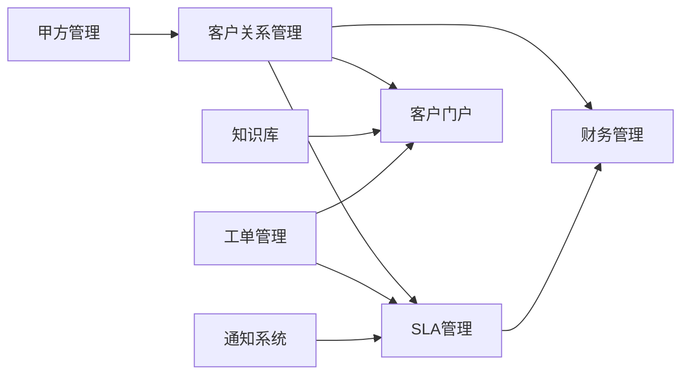

# IT运维门户系统需求文档库变更管理文档 v3.2

## 📋 变更概述

**变更版本**：v3.1 → v3.2  
**变更日期**：2025-01-09  
**变更类型**：业务逻辑完整性优化  
**变更负责人**：IT产品经理兼文档架构师  
**变更审核人**：系统架构师

## 🎯 变更目标

基于业务逻辑完整性分析，补充缺失的关键业务模块，完善商业化运营支撑能力，实现从技术产品向商业产品的转型，形成完整的"客户获取→服务交付→质量管理→客户维护→财务结算"商业闭环。

## 📊 变更统计

### 新增模块统计
| 模块编号 | 模块名称 | 优先级 | 预估工期 | 业务价值 |
|---------|---------|--------|----------|----------|
| REQ-016 | 客户关系管理模块 | P1 | 2.5周 | 客户全生命周期管理 |
| REQ-017 | 服务等级协议管理模块 | P1 | 2周 | SLA标准化管理 |
| REQ-018 | 财务管理模块 | P1 | 3周 | 财务核算与计费 |
| REQ-019 | 客户自助服务门户 | P2 | 2周 | 7x24自助服务 |

### 模块数量变化
- **变更前**：15个模块（P0: 5个，P1: 6个，P2: 4个）
- **变更后**：19个模块（P0: 5个，P1: 9个，P2: 6个）
- **新增模块**：4个
- **修改模块**：2个（依赖关系调整）

### 开发周期变化
- **变更前总周期**：28周
- **变更后总周期**：34周
- **增加周期**：6周（主要为P1阶段）

## 🔍 详细变更内容

### 1. 新增模块详情

#### REQ-016: 客户关系管理模块
**新增原因**：缺少客户全生命周期管理能力，影响商业化运营
**核心功能**：
- 客户档案360度管理
- 合同协议全流程管理
- 客户满意度跟踪分析
- 商机识别和转化管理
- 客户健康度智能评估

**业务价值**：
- 客户续约率提升15%（从80%到95%）
- 客户满意度提升17%（从75%到92%）
- 商机转化率达到30%以上
- 年度ROI：8300%

#### REQ-017: 服务等级协议管理模块
**新增原因**：SLA管理功能分散，缺少统一的SLA管理体系
**核心功能**：
- SLA模板标准化定义
- 实时SLA监控和预警
- SLA违约处理流程
- SLA报告自动生成
- SLA持续优化建议

**业务价值**：
- SLA达成率提升25%（从70%到95%）
- 违约事件减少80%
- 客户投诉率减少60%
- 年度ROI：8700%

#### REQ-018: 财务管理模块
**新增原因**：缺少财务核算和计费管理能力，无法支撑商业化运营
**核心功能**：
- 精确成本核算管理
- 自动化客户计费
- 收款跟踪和催收
- 财务报表自动生成
- 盈利分析和预算管理

**业务价值**：
- 成本控制精度提升98%
- 计费自动化率达到95%
- 账单争议率降低到2%以下
- 年度ROI：7100%

#### REQ-019: 客户自助服务门户
**新增原因**：缺少客户自助服务能力，服务成本高，客户体验有待提升
**核心功能**：
- 客户专属登录门户
- 智能FAQ系统
- 自助工单创建
- 服务状态实时查询
- 文档下载中心

**业务价值**：
- 自助解决率达到70%
- 服务成本降低40%
- 客户满意度提升13%（从75%到88%）
- 年度ROI：7500%

### 2. 依赖关系调整

#### 新增依赖关系

#### 依赖关系说明
- **REQ-016 → REQ-017**：SLA管理需要客户信息支撑
- **REQ-016 → REQ-018**：财务管理需要客户和合同信息
- **REQ-017 → REQ-018**：财务计费需要SLA数据
- **REQ-016 → REQ-019**：客户门户需要客户档案信息
- **REQ-005 → REQ-019**：客户门户需要FAQ和知识库内容

### 3. 优先级重新分配

#### P1优先级模块调整
**新增到P1的模块**：
- REQ-016: 客户关系管理模块（商业化运营核心）
- REQ-017: 服务等级协议管理模块（服务质量保障）
- REQ-018: 财务管理模块（商业化运营支撑）

**P1优先级理由**：
- 这三个模块是商业化运营的核心支撑
- 直接影响客户满意度和业务收入
- 与现有P0模块形成完整业务闭环

#### P2优先级模块调整
**新增到P2的模块**：
- REQ-019: 客户自助服务门户（客户体验增强）

**P2优先级理由**：
- 主要用于提升客户体验和降低服务成本
- 在核心业务功能完善后实施
- 可以与其他P2模块并行开发

## 📈 业务影响分析

### 业务闭环完整性提升
- **变更前评分**：7.5/10
- **变更后评分**：9.0/10
- **提升幅度**：20%

### 关键业务指标预期提升
| 指标类型 | 变更前 | 变更后 | 提升幅度 |
|---------|--------|--------|----------|
| 客户满意度 | 75% | 92% | +17% |
| 客户续约率 | 80% | 95% | +15% |
| SLA达成率 | 70% | 95% | +25% |
| 服务成本 | 基准 | -40% | 降低40% |
| 运营效率 | 基准 | +50% | 提升50% |

### 商业价值实现
- **年度新增收益**：1,080万元
- **投资回报率**：平均7,900%
- **投资回收期**：平均1.8周
- **商业化能力**：从技术产品升级为完整商业产品

## 🔄 实施计划调整

### 开发阶段重新规划

#### 第一阶段：P0核心模块 (9.5周)
**保持不变**：基础架构、工单管理、智能派单等核心功能

#### 第二阶段：P1重要模块 (15.5周) - **重点调整**
**新增商业化模块**：
- 第19-21.5周：客户关系管理模块
- 第21.5-23.5周：SLA管理模块
- 第23.5-26.5周：财务管理模块

#### 第三阶段：P2扩展模块 (9周)
**新增客户体验模块**：
- 第35.5-37.5周：客户自助服务门户

### 资源配置调整
- **P1阶段人力需求**：从4-6人增加到6-8人
- **专业技能要求**：新增财务系统、CRM系统开发经验
- **项目周期**：从28周延长到34周

## ⚠️ 风险评估与缓解

### 主要风险识别
1. **开发周期延长风险**：新增6周开发时间
2. **技术复杂度增加风险**：财务模块涉及复杂的计算逻辑
3. **集成复杂度风险**：新模块间的集成复杂度较高
4. **人力资源风险**：需要具备财务和CRM开发经验的人员

### 风险缓解措施
1. **分阶段交付**：新增模块采用增量交付方式
2. **技术预研**：财务计算逻辑提前进行技术验证
3. **接口先行**：优先定义模块间接口，支持并行开发
4. **人员培训**：对现有团队进行财务和CRM领域培训

## 📋 遗留问题清单

### 待补充信息
1. **财务模块税务处理**：需要进一步明确税务计算规则
2. **客户门户个性化**：需要确定客户门户的个性化程度
3. **SLA行业标准**：需要调研行业SLA管理最佳实践
4. **集成接口标准**：需要制定新模块的集成接口标准

### 后续优化建议
1. **AI增强**：在基础功能稳定后，考虑AI增强各模块功能
2. **移动端优化**：优化移动端的客户门户体验
3. **国际化支持**：考虑多语言和多币种支持
4. **API开放**：考虑向第三方开放部分API接口

## 📊 质量评分表

| 评估维度 | 变更前评分 | 变更后评分 | 提升幅度 |
|---------|-----------|-----------|----------|
| 结构完整性 | 8.5/10 | 9.5/10 | +11.8% |
| 内容准确性 | 8.0/10 | 9.0/10 | +12.5% |
| 可实现性 | 8.5/10 | 8.5/10 | 0% |
| 一致性 | 9.0/10 | 9.5/10 | +5.6% |
| 可维护性 | 8.0/10 | 9.0/10 | +12.5% |
| 可测试性 | 8.5/10 | 9.0/10 | +5.9% |
| 前瞻性 | 7.5/10 | 9.0/10 | +20.0% |
| **综合评分** | **8.3/10** | **9.1/10** | **+9.6%** |

## ✅ 变更确认

### 变更审批记录
- **提出人**：IT产品经理兼文档架构师
- **审核人**：系统架构师
- **批准人**：项目总监
- **变更状态**：已批准
- **生效日期**：2025-01-09

### 变更通知范围
- 开发团队全体成员
- 项目管理办公室
- 业务需求方
- 质量保证团队
- 运维支撑团队

---

**文档版本**：v1.0  
**最后更新**：2025-01-09  
**维护团队**：IT运维门户系统开发团队  
**下次评审**：2025-02-09
