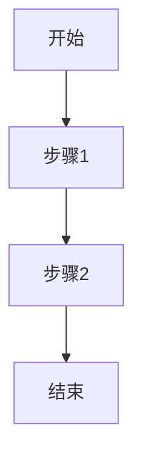
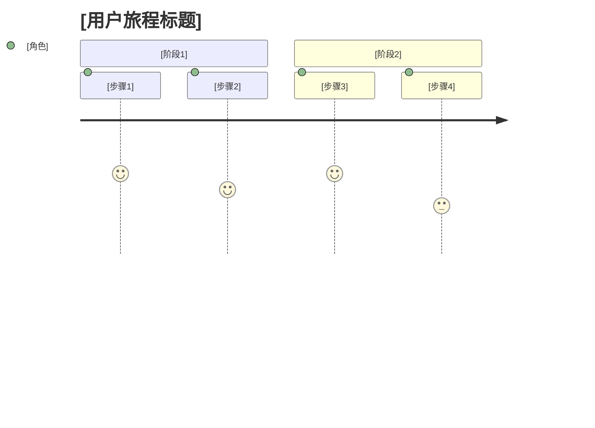
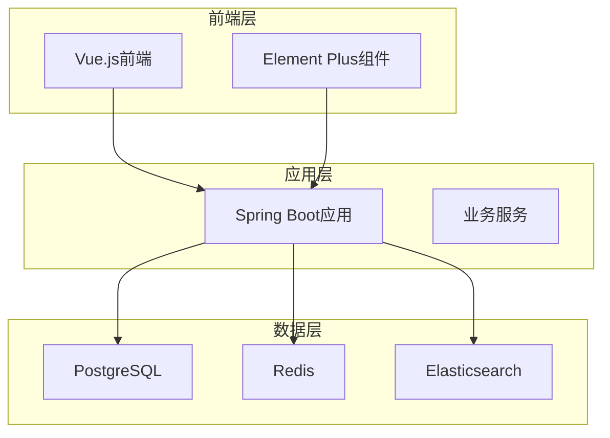
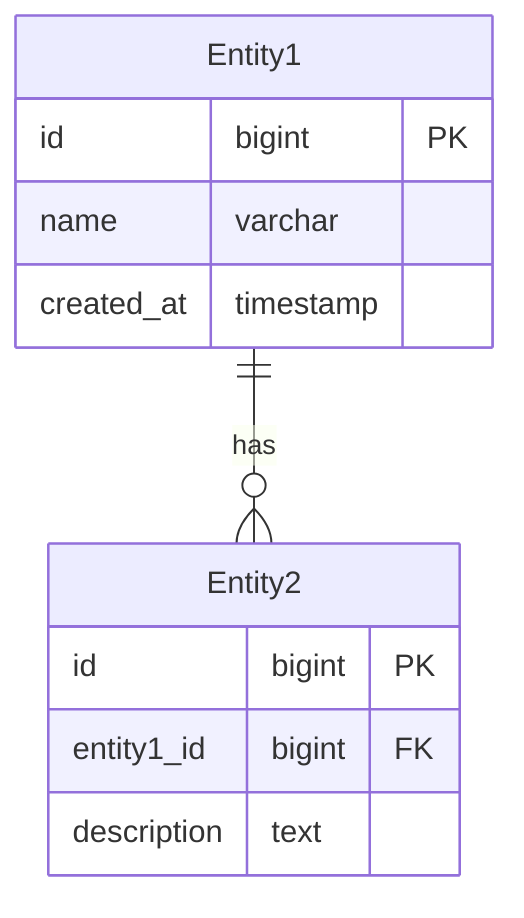

# REQ-XXX: [模块名称]需求文档

## 1. 业务描述（Business Description）

### 业务背景
[描述项目起源、市场环境、用户痛点]

### 业务目标
[具体、可衡量的业务指标，如：提升效率XX%]

### 业务流程


### 用户画像
- **[用户角色1]**：[用户特征和使用场景]
- **[用户角色2]**：[用户特征和使用场景]

## 2. 业务价值（Business Value）

### 价值主张
[解决方案如何解决用户痛点]

### ROI分析
- **开发投入**：[人天数]，约[金额]
- **年度收益**：
  - [收益项1]：[金额]
  - [收益项2]：[金额]
- **投资回报率**：[百分比]，投资回收期：[时间]

### KPI指标
- **[指标1]**：[目标值]
- **[指标2]**：[目标值]
- **[指标3]**：[目标值]

### 竞争优势
- **[优势1]**：[具体描述]
- **[优势2]**：[具体描述]

## 3. 产品交互（Product Interaction）

### 用户旅程图


### 界面原型
- **[页面1]**：[基于portal-prototype实际实现的描述]
- **[页面2]**：[基于portal-prototype实际实现的描述]

### 交互规范
- **[交互1]**：[动效、反馈、状态转换规则]
- **[交互2]**：[动效、反馈、状态转换规则]

### 信息架构
[功能模块组织关系图]

## 4. 功能需求（Functional Requirements）

### 功能清单
| 功能编号 | 功能名称 | 优先级 | 实现状态 | 描述 |
|---------|---------|--------|----------|------|
| F001 | [功能1] | P0 | ✅已实现 | [功能描述] |
| F002 | [功能2] | P1 | 🔄部分实现 | [功能描述] |
| F003 | [功能3] | P2 | ❌未实现 | [功能描述] |

### 用户故事
- **作为**[角色]，**我需要**[功能]，**以便**[价值]
- **作为**[角色]，**我需要**[功能]，**以便**[价值]

### 用例描述
#### UC001: [用例名称]
- **前置条件**：[条件描述]
- **主流程**：
  1. [步骤1]
  2. [步骤2]
  3. [步骤3]
- **备选流程**：
  - [异常情况1]：[处理方式]
  - [异常情况2]：[处理方式]
- **后置条件**：[结果描述]

### 业务规则
- **BR001**：[业务规则描述]
- **BR002**：[业务规则描述]

## 5. 非功能需求（Non-Functional Requirements）

### 性能需求
- **响应时间**：API平均响应 <[时间]ms
- **并发用户数**：支持[数量]+并发用户
- **吞吐量**：[数量]TPS

### 可用性需求
- **系统可用性**：[百分比]%
- **故障恢复时间**：<[时间]分钟
- **数据备份**：[频率]备份

### 可扩展性需求
- **用户规模**：支持[数量]+用户
- **数据量**：支持[容量]级数据存储
- **功能扩展**：[扩展能力描述]

### 安全需求
- **数据隔离**：多租户数据完全隔离
- **权限控制**：基于角色的细粒度权限
- **审计日志**：完整的操作审计记录
- **数据加密**：敏感数据加密存储

## 6. 系统架构（System Architecture）

### 整体架构


### 技术栈
- **后端框架**：Spring Boot 3.2 + Java 17
- **前端框架**：Vue 3 + Element Plus
- **数据库**：PostgreSQL 15 + Redis 7
- **其他组件**：[具体组件列表]

### 部署架构
[服务器配置和网络拓扑描述]

### 集成架构
[与外部系统的集成方式]

## 7. 数据模型（Data Model）

### 实体关系图


### API规范
#### [API名称]
- **URL**：`[HTTP方法] /api/v1/[路径]`
- **请求参数**：
  ```json
  {
    "param1": "string",
    "param2": "integer"
  }
  ```
- **响应格式**：
  ```json
  {
    "code": 200,
    "message": "success",
    "data": {}
  }
  ```

### 数据字典
| 字段名 | 类型 | 长度 | 是否必填 | 默认值 | 说明 |
|--------|------|------|----------|--------|------|
| id | bigint | - | 是 | - | 主键ID |
| name | varchar | 100 | 是 | - | 名称 |

### 数据流
[系统间数据传递关系描述]

## 8. 验收标准（Acceptance Criteria）

### 功能验收
#### AC001: [验收项目]
- **Given** [前置条件]
- **When** [操作步骤]
- **Then** [预期结果]

### 性能验收
- **负载测试**：[并发用户数]用户同时访问，响应时间<[时间]ms
- **压力测试**：[测试条件]下系统稳定运行
- **容量测试**：支持[数据量]数据存储和处理

### UX验收
- **易用性测试**：新用户[时间]内完成核心操作
- **兼容性测试**：支持主流浏览器和设备
- **响应式测试**：适配不同屏幕尺寸

### 安全验收
- **权限测试**：验证角色权限控制有效性
- **数据隔离测试**：验证多租户数据隔离
- **漏洞扫描**：无高危安全漏洞

## 9. 依赖与约束（Dependencies & Constraints）

### 技术栈限制
- **Java版本**：JDK 17+
- **Node.js版本**：18+
- **数据库版本**：PostgreSQL 15+

### 集成需求
- **[外部系统1]**：[集成要求]
- **[外部系统2]**：[集成要求]

### 合规要求
- **等保三级**：符合网络安全等级保护要求
- **数据保护**：符合个人信息保护法规

### 资源约束
- **开发时间**：[时间]
- **开发人力**：[人数]
- **预算限制**：[金额]

---

**文档版本**：v3.0  
**最后更新**：[日期]  
**负责人**：[姓名]
