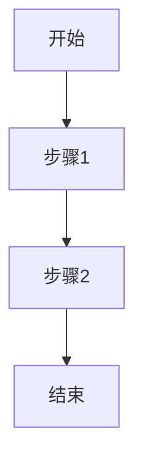
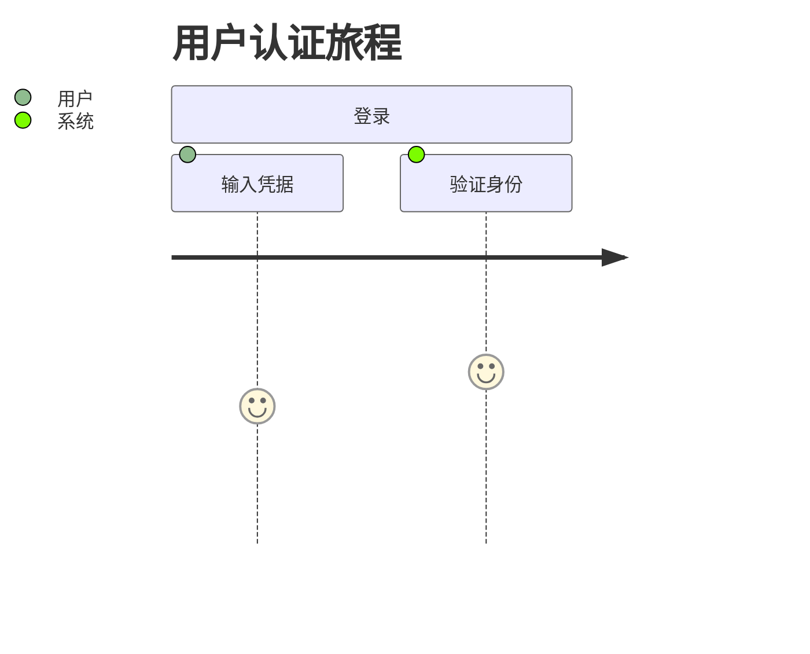
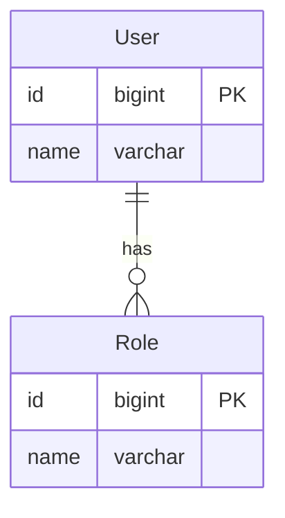

# 需求文档编写规范

## 📝 文档编写原则

### 1. 实现导向原则
- **以实际实现为准**：所有功能描述必须基于portal-prototype前端实际实现
- **代码一致性**：技术要求与实际使用的技术栈完全匹配
- **状态标识**：明确标识功能的实现状态（已实现/部分实现/未实现）

### 2. 完整性原则
- **9要素完整**：每个模块文档必须包含完整的9个要素
- **信息充分**：提供足够的信息供开发团队使用
- **上下文清晰**：确保读者能够理解功能的业务背景和技术背景

### 3. 一致性原则
- **格式统一**：使用统一的文档模板和格式规范
- **术语统一**：使用统一的技术术语和业务术语
- **风格统一**：保持文档写作风格的一致性

## 📋 文档结构规范

### 文件命名规范
- 总览文档：`00-需求文档总览.md`
- 功能模块：`01-基础架构与认证系统.md`、`02-工作台与仪表板.md` 等
- 附录文档：`功能模块映射表.md`、`实现状态报告.md` 等

### 标题层级规范
```markdown
# REQ-XXX: 模块名称需求文档        # 一级标题：文档标题
## 1. 业务描述                    # 二级标题：9要素标题
### 业务背景                     # 三级标题：要素子项
#### 具体内容                   # 四级标题：详细内容
```

### 编号规范
- **需求编号**：REQ-001 到 REQ-015（已统一，严禁重复）
- **功能编号**：F001、F002 等
- **用例编号**：UC001、UC002 等
- **验收编号**：AC001、AC002 等
- **业务规则**：BR001、BR002 等

### 最新模块编号分配 (2025-01-09更新)
- **P0核心模块**：REQ-001, REQ-002, REQ-003, REQ-004, REQ-010
- **P1重要模块**：REQ-005, REQ-006, REQ-007, REQ-011, REQ-012
- **P2扩展模块**：REQ-008, REQ-009, REQ-013, REQ-014, REQ-015

## 🎯 内容编写规范

### 1. 业务描述编写要点
- **业务背景**：结合多租户运维服务场景，突出痛点和需求
- **业务目标**：使用具体、可衡量的指标，如"提升效率30%"
- **业务流程**：使用Mermaid图表，清晰展示流程步骤
- **用户画像**：明确区分系统管理员、租户管理员、运维工程师、甲方用户

### 2. 业务价值编写要点
- **价值主张**：明确说明如何解决用户痛点
- **ROI分析**：提供具体的投入产出分析
- **KPI指标**：设定可衡量的关键成功指标
- **竞争优势**：突出与竞品的差异化优势

### 3. 产品交互编写要点
- **用户旅程图**：使用Mermaid journey图表
- **界面原型**：基于portal-prototype实际实现描述
- **交互规范**：详细描述动效、反馈、状态转换
- **信息架构**：清晰展示功能模块组织关系

### 4. 功能需求编写要点
- **功能清单**：使用表格形式，包含优先级和实现状态
- **用户故事**：使用标准格式"作为...我需要...以便..."
- **用例描述**：包含前置条件、主流程、备选流程、后置条件
- **业务规则**：明确系统行为的约束条件

### 5. 非功能需求编写要点
- **性能需求**：提供具体的数值指标
- **可用性需求**：明确系统可用性要求
- **可扩展性需求**：考虑未来扩展需要
- **安全需求**：重点关注多租户数据隔离

### 6. 系统架构编写要点
- **整体架构**：使用Mermaid架构图
- **技术栈**：确保与实际使用的技术完全一致
- **部署架构**：考虑实际部署环境
- **集成架构**：明确与外部系统的集成方式

### 7. 数据模型编写要点
- **实体关系图**：使用Mermaid ER图
- **API规范**：提供完整的接口定义
- **数据字典**：详细定义字段属性
- **数据流**：描述数据在系统间的流转

### 8. 验收标准编写要点
- **功能验收**：使用Given-When-Then格式
- **性能验收**：提供具体的测试指标
- **UX验收**：关注用户体验质量
- **安全验收**：重点验证安全要求

### 9. 依赖与约束编写要点
- **技术栈限制**：明确版本要求
- **集成需求**：详细说明集成要求
- **合规要求**：考虑法规和标准要求
- **资源约束**：明确时间、人力、预算限制

## 🔧 技术规范

### Mermaid图表规范
```markdown
# 流程图


# 用户旅程图


# 实体关系图

```

### 表格规范
```markdown
| 列标题1 | 列标题2 | 列标题3 |
|---------|---------|---------|
| 内容1   | 内容2   | 内容3   |
| 内容4   | 内容5   | 内容6   |
```

### 代码块规范
```markdown
```json
{
  "code": 200,
  "message": "success",
  "data": {}
}
```
```

## ✅ 质量检查清单

### 内容完整性检查
- [ ] 包含完整的9个要素
- [ ] 每个要素内容充分详细
- [ ] 功能描述与前端实现一致
- [ ] 技术要求与实际技术栈匹配

### 格式规范检查
- [ ] 使用统一的文档模板
- [ ] 标题层级正确
- [ ] 编号规范统一
- [ ] 图表格式正确

### 逻辑一致性检查
- [ ] 业务流程逻辑清晰
- [ ] 功能需求相互协调
- [ ] 技术架构合理可行
- [ ] 验收标准可测试

### 可读性检查
- [ ] 语言表达清晰准确
- [ ] 专业术语使用恰当
- [ ] 结构层次分明
- [ ] 重点内容突出

## 📚 参考资源

### 内部参考
- `doc/需求文档v2/` - 参考v2文档结构和内容
- `portal-prototype/src/` - 前端实际实现参考
- `doc/项目开发规则.md` - 项目开发标准

### 外部参考
- [Mermaid官方文档](https://mermaid-js.github.io/mermaid/)
- [Markdown语法指南](https://www.markdownguide.org/)
- [需求工程最佳实践](https://www.iiba.org/)

---

**规范版本**：v1.0  
**最后更新**：2025年7月  
**维护团队**：IT运维门户系统开发团队
