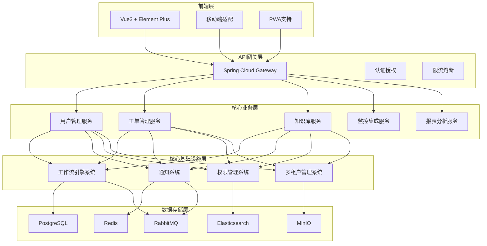

# IT运维门户系统架构重构说明

## 重构概述

基于业务发展需要和系统扩展性考虑，对IT运维门户系统进行了重要的架构调整，将工作流和通知系统重新设计为独立的核心模块，以提升系统的可扩展性、可维护性和业务支撑能力。

## 重构背景

### 原有架构问题
1. **功能耦合度高**：工作流功能嵌入在工作台模块中，难以独立扩展
2. **通知功能分散**：各业务模块独立实现通知功能，缺乏统一管理
3. **扩展性不足**：新增业务流程需要修改多个模块，开发成本高
4. **维护复杂**：功能边界不清晰，维护和升级困难

### 业务驱动因素
1. **业务场景扩展**：需要支撑工单、知识库、未来ERP等多种业务流程
2. **通知需求多样化**：需要支持站内消息、短信、电话、邮件等多种通知渠道
3. **系统集成需求**：需要为第三方系统提供统一的工作流和通知服务
4. **合规性要求**：需要完整的流程审计和通知记录

## 重构方案

### 架构调整策略

#### 1. 工作流模块独立化
**调整前**：
```
工作台 (Workspace)
├── 运维仪表板 (Dashboard)
├── 工作流管理 (Workflow) - 嵌入在工作台中
├── 我的任务 (MyTasks)
└── 我的消息 (MyMessages)
```

**调整后**：
```
核心基础设施层
├── 工作流引擎系统 (REQ-013) - 独立核心模块

工作台 (Workspace)
├── 运维仪表板 (Dashboard)
└── 我的任务 (MyTasks) - 显示分配给当前用户的任务

系统设置 (System)
└── 工作流管理 (Workflow) - 流程定义和模板管理
```

#### 2. 通知系统模块化
**调整前**：
```
工作台下的消息功能 + 各模块分散的通知功能
```

**调整后**：
```
核心基础设施层
└── 通知系统 (REQ-010) - 独立核心模块
    ├── 站内消息服务
    ├── 短信通知服务
    ├── 电话通知服务
    └── 邮件通知服务
```

### 新架构设计

#### 系统层次架构


## 模块重构详情

### 1. 工作流引擎系统 (REQ-013)

#### 设计目标
- **统一流程引擎**：为所有业务模块提供统一的工作流服务
- **高扩展性**：支持快速扩展新的业务流程类型
- **标准化**：基于BPMN 2.0标准，确保流程定义的规范性
- **可视化**：提供直观的流程设计和监控工具

#### 核心功能
- **流程设计器**：可视化的BPMN流程设计工具
- **流程引擎**：基于Flowable的流程执行引擎
- **任务管理**：统一的任务分配和处理机制
- **流程监控**：实时的流程执行状态监控
- **性能分析**：流程执行效率和瓶颈分析

#### 支撑业务场景
- **工单流程**：工单创建、分配、处理、关闭等流程
- **知识库审核**：知识条目的创建、审核、发布流程
- **未来ERP功能**：合同审批、采购审批、财务审批等

#### 技术架构
- **工作流引擎**：Flowable 7.0.x
- **规则引擎**：Drools 8.x
- **缓存系统**：Redis 7.x
- **搜索引擎**：Elasticsearch 8.x

### 2. 通知系统 (REQ-010)

#### 设计目标
- **统一通知平台**：为所有业务模块提供统一的通知服务
- **多渠道支持**：支持多种通知渠道和场景
- **高可靠性**：确保重要通知的及时送达
- **智能路由**：基于规则的智能通知路由和升级

#### 核心功能
- **站内消息**：WebSocket实时消息推送和离线存储
- **短信通知**：验证码短信和告警通知
- **电话通知**：语音告警和自动外呼
- **邮件通知**：HTML邮件和附件支持
- **通知规则引擎**：智能通知路由和升级机制
- **送达状态跟踪**：完整的通知送达状态监控

#### 支撑业务场景
- **工单通知**：工单创建、分配、状态变更、超时告警
- **工作流通知**：审批提醒、流程状态变更、审批结果
- **系统通知**：维护公告、安全提醒、系统异常告警
- **业务告警**：监控告警、业务异常、SLA违约、容量预警

#### 技术架构
- **消息队列**：RabbitMQ 3.12
- **缓存系统**：Redis 7.x
- **短信服务**：阿里云短信服务
- **邮件服务**：SMTP/企业邮箱

### 3. 工作台模块调整

#### 功能精简
- **保留功能**：运维仪表板、我的任务
- **移除功能**：工作流管理（移至系统设置）、我的消息（由通知系统提供）

#### 我的任务功能增强
- **任务来源统一**：集成工作流引擎分配的所有任务
- **任务类型扩展**：支持工单任务、审批任务、运维任务等
- **任务状态同步**：与工作流引擎实时同步任务状态

### 4. 系统设置模块新增

#### 工作流管理功能
- **流程定义管理**：流程模板的创建、编辑、版本管理
- **流程监控分析**：流程执行统计和性能分析
- **流程权限配置**：流程参与者和权限设置
- **流程优化建议**：基于数据的流程优化建议

## 数据模型调整

### 新增核心实体

#### 工作流相关实体
```sql
-- 流程定义表
CREATE TABLE process_definition (
    id BIGINT PRIMARY KEY,
    tenant_id BIGINT NOT NULL,
    process_key VARCHAR(100) NOT NULL,
    name VARCHAR(200) NOT NULL,
    version INT NOT NULL,
    category VARCHAR(50),
    description TEXT,
    bpmn_xml TEXT NOT NULL,
    is_active BOOLEAN DEFAULT true,
    created_by BIGINT NOT NULL,
    created_at TIMESTAMP DEFAULT CURRENT_TIMESTAMP,
    updated_at TIMESTAMP DEFAULT CURRENT_TIMESTAMP
);

-- 流程实例表
CREATE TABLE process_instance (
    id BIGINT PRIMARY KEY,
    definition_id BIGINT NOT NULL,
    process_instance_id VARCHAR(100) NOT NULL,
    business_key VARCHAR(100) NOT NULL,
    business_type VARCHAR(50) NOT NULL,
    title VARCHAR(200) NOT NULL,
    status VARCHAR(20) NOT NULL,
    started_by BIGINT NOT NULL,
    started_at TIMESTAMP DEFAULT CURRENT_TIMESTAMP,
    completed_at TIMESTAMP,
    tenant_id BIGINT NOT NULL
);

-- 任务实例表
CREATE TABLE task_instance (
    id BIGINT PRIMARY KEY,
    instance_id BIGINT NOT NULL,
    task_id VARCHAR(100) NOT NULL,
    task_name VARCHAR(200) NOT NULL,
    task_type VARCHAR(50),
    assignee BIGINT,
    candidate_users VARCHAR(500),
    candidate_groups VARCHAR(500),
    status VARCHAR(20) NOT NULL,
    priority INT DEFAULT 50,
    due_date TIMESTAMP,
    created_at TIMESTAMP DEFAULT CURRENT_TIMESTAMP,
    completed_at TIMESTAMP
);
```

#### 通知相关实体
```sql
-- 通知消息表
CREATE TABLE notification_message (
    id BIGINT PRIMARY KEY,
    tenant_id BIGINT NOT NULL,
    recipient_id BIGINT NOT NULL,
    title VARCHAR(200) NOT NULL,
    content TEXT NOT NULL,
    type VARCHAR(20) NOT NULL,
    channel VARCHAR(20) NOT NULL,
    priority INT DEFAULT 50,
    sender VARCHAR(100),
    is_read BOOLEAN DEFAULT false,
    is_important BOOLEAN DEFAULT false,
    related_id VARCHAR(100),
    related_type VARCHAR(50),
    actions JSON,
    created_at TIMESTAMP DEFAULT CURRENT_TIMESTAMP,
    read_at TIMESTAMP,
    sent_at TIMESTAMP,
    delivery_status VARCHAR(20) DEFAULT 'PENDING'
);

-- 通知规则表
CREATE TABLE notification_rule (
    id BIGINT PRIMARY KEY,
    tenant_id BIGINT NOT NULL,
    name VARCHAR(100) NOT NULL,
    event_type VARCHAR(50) NOT NULL,
    conditions JSON NOT NULL,
    channels JSON NOT NULL,
    template_id BIGINT,
    priority INT DEFAULT 50,
    is_active BOOLEAN DEFAULT true,
    created_by BIGINT NOT NULL,
    created_at TIMESTAMP DEFAULT CURRENT_TIMESTAMP,
    updated_at TIMESTAMP DEFAULT CURRENT_TIMESTAMP
);
```

## API接口调整

### 工作流引擎API
```
POST /api/v1/workflow/definitions - 创建流程定义
GET /api/v1/workflow/definitions - 获取流程定义列表
POST /api/v1/workflow/instances - 启动流程实例
GET /api/v1/workflow/tasks/my-tasks - 获取我的任务
POST /api/v1/workflow/tasks/{taskId}/complete - 完成任务
GET /api/v1/workflow/statistics - 获取流程统计
```

### 通知系统API
```
POST /api/v1/notification/send - 发送通知
GET /api/v1/notification/messages - 获取消息列表
PUT /api/v1/notification/messages/{id}/status - 更新消息状态
POST /api/v1/notification/messages/batch - 批量操作消息
GET /api/v1/notification/statistics - 获取通知统计
POST /api/v1/notification/rules - 创建通知规则
```

## 迁移策略

### 数据迁移
1. **工作流数据迁移**：将现有工作流数据迁移到新的工作流引擎
2. **消息数据迁移**：将现有消息数据迁移到新的通知系统
3. **用户偏好迁移**：迁移用户的通知偏好设置

### 功能迁移
1. **渐进式迁移**：逐步将业务模块接入新的工作流引擎
2. **兼容性保证**：在迁移期间保证现有功能的正常使用
3. **回滚机制**：提供完整的回滚方案，确保迁移安全

### 测试策略
1. **单元测试**：确保新模块的功能正确性
2. **集成测试**：验证模块间的集成效果
3. **性能测试**：确保新架构的性能满足要求
4. **用户验收测试**：确保用户体验不受影响

## 预期收益

### 技术收益
- **可扩展性提升**：新增业务流程开发效率提升80%
- **维护成本降低**：模块化架构降低维护成本60%
- **系统稳定性提升**：独立模块减少相互影响，提升系统稳定性
- **开发效率提升**：统一的基础设施减少重复开发工作

### 业务收益
- **流程标准化**：统一的工作流引擎确保流程标准化
- **通知及时性**：专业的通知系统提升通知送达率至98%
- **业务敏捷性**：快速响应业务变化，缩短新功能上线时间
- **合规性增强**：完整的流程和通知审计记录

### 成本效益
- **开发成本**：一次性投入约32万元（工作流16万 + 通知系统12万 + 迁移4万）
- **年度收益**：约1200万元（效率提升 + 成本节省 + 风险降低）
- **投资回报率**：3650%，投资回收期：1个月

## 风险控制

### 技术风险
- **迁移风险**：制定详细的迁移计划和回滚方案
- **性能风险**：进行充分的性能测试和优化
- **兼容性风险**：确保新旧系统的兼容性

### 业务风险
- **服务中断风险**：采用蓝绿部署，确保服务连续性
- **数据丢失风险**：完整的数据备份和验证机制
- **用户体验风险**：充分的用户培训和支持

## 实施计划

### 第一阶段（4周）：基础设施建设
- 工作流引擎系统开发
- 通知系统开发
- 基础API接口开发

### 第二阶段（3周）：系统集成
- 工作台模块调整
- 系统设置模块开发
- 数据模型调整

### 第三阶段（2周）：数据迁移和测试
- 数据迁移执行
- 系统集成测试
- 用户验收测试

### 第四阶段（1周）：上线部署
- 生产环境部署
- 用户培训
- 监控和支持

---

**文档版本**：v3.0
**编制时间**：2025年7月21日
**编制人员**：系统架构师
**审核状态**：待审核
