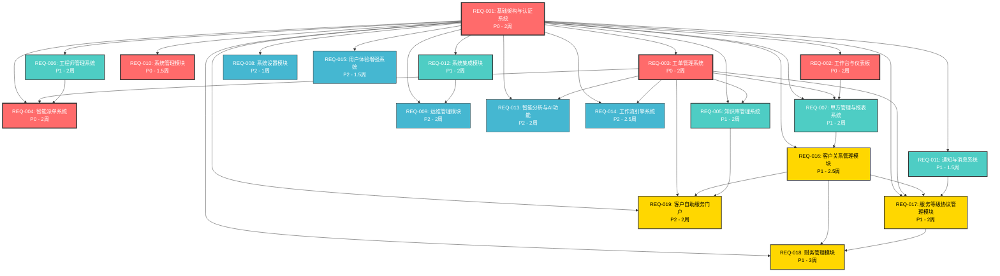

# IT运维门户系统模块依赖关系图

## 📋 文档说明

本文档展示IT运维门户系统各模块间的依赖关系，为开发团队提供清晰的实施顺序指导。

**文档版本**：v3.0  
**最后更新**：2025-01-09  
**维护人员**：系统架构师

## 🎯 整体依赖关系图

## 📊 优先级分层实施策略

### 第一阶段：P0核心模块 (9.5周)
**实施顺序**：
1. **REQ-001 基础架构与认证系统** (2周) - 所有模块的基础
2. **REQ-010 系统管理模块** (1.5周) - 用户权限管理
3. **REQ-003 工单管理系统** (2周) - 核心业务功能
4. **REQ-002 工作台与仪表板** (2周) - 用户主界面
5. **REQ-004 智能派单系统** (2周) - 依赖工单和工程师管理

**关键里程碑**：
- 第2周：基础认证系统可用
- 第3.5周：用户权限管理完成
- 第5.5周：工单管理系统可用
- 第7.5周：仪表板展示完成
- 第9.5周：智能派单系统完成

### 第二阶段：P1重要模块 (15.5周)
**实施顺序**：
1. **REQ-006 工程师管理系统** (2周) - 支持派单系统
2. **REQ-011 通知与消息系统** (1.5周) - 基础通信设施
3. **REQ-005 知识库管理系统** (2周) - 知识沉淀
4. **REQ-012 系统集成模块** (2周) - 第三方系统集成
5. **REQ-007 甲方管理与报表系统** (2周) - 客户服务界面
6. **REQ-016 客户关系管理模块** (2.5周) - 客户全生命周期管理
7. **REQ-017 服务等级协议管理模块** (2周) - SLA管理
8. **REQ-018 财务管理模块** (3周) - 财务核算与计费

**关键里程碑**：
- 第11.5周：工程师管理完成
- 第13周：通知系统可用
- 第15周：知识库系统完成
- 第17周：系统集成完成
- 第19周：甲方管理完成
- 第21.5周：客户关系管理完成
- 第23.5周：SLA管理完成
- 第26.5周：财务管理完成

### 第三阶段：P2扩展模块 (9周)
**实施顺序**：
1. **REQ-008 系统设置模块** (1周) - 系统配置管理
2. **REQ-015 用户体验增强系统** (1.5周) - 用户体验优化
3. **REQ-009 运维管理模块** (2周) - 运维工具集成
4. **REQ-013 智能分析与AI功能** (2周) - AI智能化
5. **REQ-014 工作流引擎系统** (2.5周) - 流程自动化
6. **REQ-019 客户自助服务门户** (2周) - 客户自助服务

**关键里程碑**：
- 第27.5周：系统设置完成
- 第29周：用户体验优化完成
- 第31周：运维管理完成
- 第33周：AI功能完成
- 第35.5周：工作流引擎完成
- 第37.5周：客户自助服务门户完成

## 🔗 关键依赖关系说明

### 强依赖关系
1. **REQ-001 → 所有模块**：基础架构是所有模块的前提
2. **REQ-003 → REQ-004**：派单系统依赖工单管理
3. **REQ-006 → REQ-004**：派单系统需要工程师信息
4. **REQ-003 → REQ-005**：知识库需要工单数据支持

### 弱依赖关系
1. **REQ-002 → REQ-007**：甲方报表需要仪表板数据
2. **REQ-012 → REQ-009**：运维管理依赖系统集成
3. **REQ-003 → REQ-013**：AI功能需要工单历史数据

### 可并行开发
1. **REQ-005, REQ-006, REQ-011** 可以并行开发
2. **REQ-008, REQ-015** 可以并行开发
3. **REQ-013, REQ-014** 可以并行开发

## ⚠️ 风险控制点

### 高风险依赖
1. **REQ-001延期风险**：影响所有后续模块，需要重点保障
2. **REQ-003延期风险**：影响派单、知识库、AI等核心功能
3. **REQ-006延期风险**：影响派单系统的完整性

### 缓解策略
1. **提前启动**：REQ-001提前1周启动，确保按时完成
2. **并行开发**：在REQ-001基础框架完成后，立即启动REQ-003和REQ-010
3. **接口先行**：优先定义模块间接口，支持并行开发
4. **增量交付**：每个模块采用增量交付，降低集成风险

## 📈 资源配置建议

### 团队配置
- **P0阶段**：6-8人全职开发团队
- **P1阶段**：4-6人开发团队
- **P2阶段**：2-4人开发团队

### 技能要求
- **后端开发**：Spring Boot、PostgreSQL、Redis专家
- **前端开发**：Vue 3、TypeScript、Element Plus专家
- **系统集成**：API集成、第三方系统对接经验
- **AI开发**：机器学习、NLP技术背景

---

**文档维护**：系统架构师  
**审核状态**：已审核  
**下次更新**：2025-02-09
